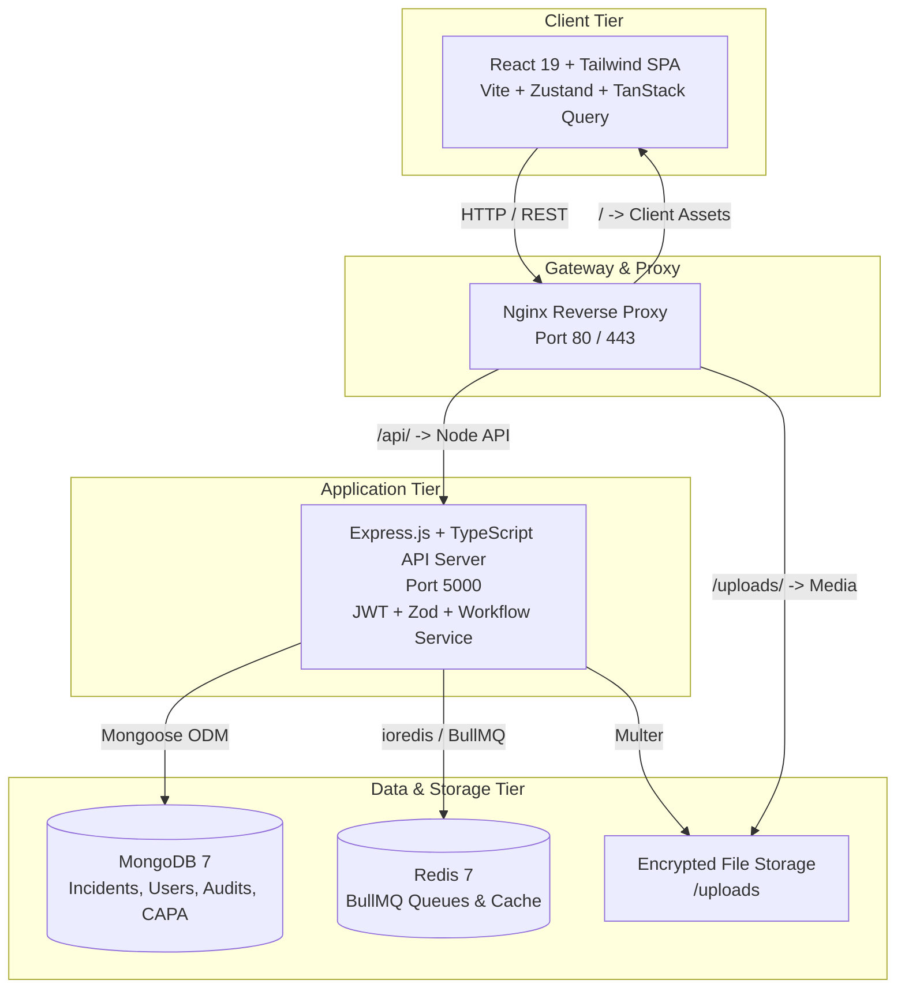
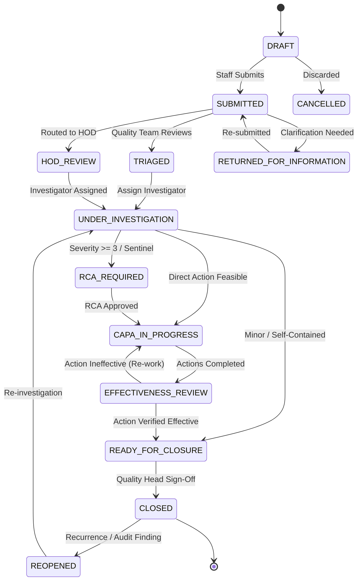

# 🏥 Adhiparasakthi Hospitals – Incident Reporting & Patient Safety Platform

[](https://nodejs.org/)
[](https://react.dev/)
[](https://www.typescriptlang.org/)
[](https://vitejs.dev/)
[](https://www.mongodb.com/)
[](https://redis.io/)
[](https://www.docker.com/)
[](https://tailwindcss.com/)
[](#nabh--jci-patient-safety-alignment)

An enterprise-grade, hospital-wide Incident Reporting, Clinical Investigation, Root Cause Analysis (RCA), and Corrective & Preventive Action (CAPA) platform engineered for **Adhiparasakthi Hospitals** (1000-bed multi-specialty healthcare facility).

Designed with a **"Just Culture" / Blame-Free Patient Safety philosophy**, this platform streamlines safety event capture, rapid triage, departmental investigations, systematic RCA (5-Why & Ishikawa/Fishbone), actionable CAPA governance, and real-time executive risk intelligence.

---

## 📑 Table of Contents

- [Key Features](#-key-features)
- [Architecture & Tech Stack](#-architecture--tech-stack)
- [System Architecture Flowchart](#-system-architecture-flowchart)
- [Incident Lifecycle & State Machine](#-incident-lifecycle--state-machine)
- [Repository Structure](#-repository-structure)
- [Prerequisites](#-prerequisites)
- [Quick Start with Docker (Recommended)](#-quick-start-with-docker-recommended)
- [Local Development Setup](#-local-development-setup)
- [Default Seed Accounts & RBAC](#-default-seed-accounts--rbac)
- [REST API Endpoints Reference](#-rest-api-endpoints-reference)
- [End-to-End Automated Testing](#-end-to-end-automated-testing)
- [Environment Configuration](#-environment-configuration)
- [NABH & JCI Patient Safety Alignment](#-nabh--jci-patient-safety-alignment)

---

## 🌟 Key Features

### 1. Rapid Incident Reporting (2–3 Minutes)
- **Fast clinical entry**: Optimized forms for doctors, nurses, pharmacists, and allied health staff.
- **Patient identification**: UHID, IP Number, Bed, Ward, and Consultant capture.
- **Healthcare taxonomy**: 8 primary healthcare categories and specialized subcategories (Patient Safety, Medication Errors, Infection Control, Facility & Equipment, Clinical Process, Behavioral/Security, Occupational Health, Information Security).
- **Severity grading**: Standardized 5-tier severity classification from Level 1 (*Near Miss*) to Level 5 (*Sentinel Event*).
- **Evidence uploads**: Direct attachment of clinical photos, charts, and diagnostic files.

### 2. Clinical Triage & Department Routing
- **Safety committee oversight**: Immediate triage queue for the Quality & Patient Safety team.
- **Severity re-classification**: Dynamic upgrade/downgrade with mandatory justification remarks.
- **Automatic routing**: Incidents automatically routed to designated Department HODs.
- **Investigator delegation**: Assignment of certified investigators based on incident complexity.

### 3. Comprehensive Investigation & Root Cause Analysis (RCA)
- **Structured investigations**: Detailed timeline reconstruction, contributing factor cataloging, immediate corrective measures, and preventive recommendations.
- **5-Why Analysis**: Step-by-step iterative interrogation of causal chains.
- **Ishikawa (Fishbone) Diagram Analysis**: Multi-dimensional cause categorization across **People**, **Process**, **Equipment**, **Environment**, **Materials**, and **Management**.
- **Formal approval gate**: Multi-level safety committee RCA review and sign-off.

### 4. CAPA Lifecycle & Effectiveness Verification
- **Corrective vs. Preventive separation**: Targeted action plans with designated departmental owners and hard deadlines.
- **Overdue tracking & prioritization**: Priority matrices (`LOW`, `MEDIUM`, `HIGH`, `CRITICAL`).
- **Post-implementation audit**: Effectiveness verification before an incident can be closed.
- **Zero premature closure**: System prevents incident closure until all linked CAPA items are fully verified.

### 5. Real-Time Hospital Safety Analytics
- **Executive KPI Dashboard**: Live counts of open, critical, under-investigation incidents and overdue CAPAs.
- **Severity distribution charts**: Interactive pie and bar breakdowns.
- **Departmental risk heatmaps**: Incident trend tracking across Emergency, ICU, OT, General Wards, and Pharmacy.
- **Downloadable registers**: Pre-formatted Incident and CAPA registers for quality audits and NABH/JCI inspections.

---

## 🛠 Architecture & Tech Stack

| Layer | Technologies |
|---|---|
| **Frontend** | React 19, TypeScript, Vite 6, Tailwind CSS, TanStack React Query v5, Zustand, React Hook Form, Zod, Recharts, Lucide React, Axios, Day.js |
| **Backend API** | Node.js 22 LTS, Express.js, TypeScript, Mongoose ODM, Zod, BullMQ, Pino Logger, Helmet, Express Rate Limit, Cookie Parser |
| **Database & Cache** | MongoDB 7.0 (Replica-set ready), Redis 7 (Queues, rate limiting, and caching) |
| **Storage & Reverse Proxy** | Local file storage with streaming / Nginx Reverse Proxy (SSL-ready, static asset caching, API proxying) |
| **Testing & Tooling** | Vitest, Supertest, cURL / Bash automated end-to-end integration test suite |

---

## 🔄 System Architecture Flowchart



---

## 🚦 Incident Lifecycle & State Machine

Every incident progresses through a verified, audited state machine:



### Severity Matrix

| Level | Severity Name | Description | Mandatory Actions |
|:---:|---|---|---|
| **1** | **Near Miss** | Event caught before reaching patient / no harm done. | Logged, trended, department notification. |
| **2** | **Minor Harm** | Minimal harm; first-aid or extra monitoring required. | HOD triage, local corrective action. |
| **3** | **Moderate Harm** | Required medical intervention or extended length of stay. | Detailed investigation, CAPA required. |
| **4** | **Major Harm** | Significant permanent or long-term impairment / intensive care. | Safety committee alert, 5-Why RCA + CAPA. |
| **5** | **Sentinel Event** | Death, severe injury, surgery on wrong site/patient, suicide. | Immediate escalation, full Fishbone + 5-Why RCA within 24h. |

---

## 📁 Repository Structure

```
├── client/                     # React 19 Frontend application
│   ├── Dockerfile              # Multi-stage production build (Node 22 -> Nginx)
│   ├── index.html              # HTML entry point
│   ├── package.json            # Client dependencies and build scripts
│   ├── src/
│   │   ├── App.tsx             # Root router and route guards
│   │   ├── components/layout/  # AppLayout, navigation header, sidebar
│   │   ├── lib/api.ts          # Axios client with JWT interceptor
│   │   ├── pages/
│   │   │   ├── LoginPage.tsx           # Authentication page
│   │   │   ├── DashboardPage.tsx       # Safety analytics & KPI graphs
│   │   │   ├── ReportIncidentPage.tsx  # Rapid incident reporting form
│   │   │   ├── IncidentRegisterPage.tsx# Search, filter, and triage list
│   │   │   ├── IncidentDetailPage.tsx  # Triage, RCA, CAPA, investigation view
│   │   │   ├── CapaManagerPage.tsx     # CAPA tracking & verification
│   │   │   ├── QualityReportsPage.tsx  # Audit registers & report downloads
│   │   │   └── AdminMasterPage.tsx     # Departments, users, and masters
│   │   └── store/useAuthStore.ts       # Zustand authentication state
│   ├── tailwind.config.js      # Hospital design system configuration
│   └── vite.config.ts          # Vite build configuration
│
├── server/                     # Express & TypeScript Backend API
│   ├── Dockerfile              # Production Node.js runner
│   ├── package.json            # Backend dependencies and scripts
│   ├── tsconfig.json           # TypeScript configuration
│   └── src/
│       ├── app.ts              # Express application setup, middlewares, routes
│       ├── server.ts           # Server bootstrap & DB connection
│       ├── common/             # Errors, enums, response helpers, counters
│       ├── config/             # DB, Redis, environment, Pino logger
│       ├── middleware/         # Auth, RBAC permissions, error handler, rate limiter
│       ├── modules/
│       │   ├── attachments/    # Multer file upload & metadata records
│       │   ├── audit/          # Immutable safety audit log service
│       │   ├── auth/           # JWT login, refresh token, password hashing
│       │   ├── capa/           # CAPA creation, updates, and verification
│       │   ├── categories/     # Incident category & subcategory masters
│       │   ├── dashboard/      # Metrics aggregations & chart data
│       │   ├── departments/    # Hospital departments (Emergency, ICU, etc.)
│       │   ├── incidents/      # Incident CRUD, workflow engine, triage
│       │   ├── investigations/ # Investigator notes, findings, timeline
│       │   ├── locations/      # Specific hospital rooms, beds, and bays
│       │   ├── notifications/  # Email and in-app safety alerts
│       │   ├── rca/            # 5-Why & Fishbone analysis engine
│       │   ├── reports/        # Incident & CAPA register export queries
│       │   ├── roles/          # Role & permission definitions
│       │   └── users/          # Staff and user directory
│       └── seeders/index.ts    # Database seeding with roles, depts, users, categories
│
├── nginx/                      # Reverse proxy configuration
│   └── nginx.conf              # Reverse proxy routing rules
├── docker-compose.yml          # Full-stack Docker orchestration
├── test_full_lifecycle.sh      # Automated 12-phase E2E integration test
├── .env.example                # Canonical environment variables template
└── README.md                   # System documentation
```

---

## 💻 Prerequisites

Before running the application locally, ensure you have:

- **Docker & Docker Compose** (Recommended): Docker 24+ and Docker Compose v2+
- *Or for manual local execution:*
  - **Node.js**: v20.x or v22.x LTS
  - **npm**: v10+
  - **MongoDB**: v6.0+ or v7.0+ (running locally on port `27017`)
  - **Redis**: v7.0+ (running locally on port `6379`)

---

## 🚀 Quick Start with Docker (Recommended)

The easiest way to launch the entire stack (MongoDB, Redis, Node Backend, React Frontend, and Nginx) is using Docker Compose:

### 1. Clone and Configure Environment

```bash
# Clone the repository
git clone <repository_url>
cd "Insident reporting"

# Copy environment variables
cp .env.example .env
```

### 2. Build and Start All Containers

```bash
docker compose up --build -d
```

### 3. Verify Container Status

```bash
docker compose ps
```

All 5 services should be healthy:
- `adhiparasakthi_nginx` → Listening on `http://localhost:80`
- `adhiparasakthi_backend` → Listening on `http://localhost:5000`
- `adhiparasakthi_frontend` → Static production assets served via internal network
- `adhiparasakthi_mongo` → Bound to `27017:27017`
- `adhiparasakthi_redis` → Bound to `6379:6379`

### 4. Seed Default Database Data

Run the database seeder inside the running backend container:

```bash
docker compose exec backend npm run seed
```

### 5. Access the Platform

- **Web Application Portal**: [http://localhost](http://localhost) (or [http://localhost:80](http://localhost:80))
- **Backend Health Check**: [http://localhost:5000/health](http://localhost:5000/health)
- **API Base URL**: `http://localhost/api/v1` (via Nginx) or `http://localhost:5000/api/v1`

---

## 💻 Local Development Setup

If you prefer running services individually for active development:

### 1. Start MongoDB and Redis

Ensure MongoDB and Redis services are active:
```bash
sudo systemctl start mongod
sudo systemctl start redis
```

### 2. Setup and Run Backend Server

```bash
cd server

# Install dependencies
npm install

# Copy environment file
cp ../.env.example .env

# Run database seeders (creates roles, users, departments, categories)
npm run seed

# Start server in watch mode with tsx
npm run dev
```

*The API server will listen at `http://localhost:5000`.*

### 3. Setup and Run Frontend Client

In a new terminal window:

```bash
cd client

# Install dependencies
npm install

# Launch Vite development server
npm run dev
```

*The frontend Vite server will be accessible at `http://localhost:5173`.*

---

## 👥 Default Seed Accounts & RBAC

The database seeder (`server/src/seeders/index.ts`) initializes standard hospital personas with preset credentials:

| Role | Username | Password | Email | Purpose & Permissions |
|---|---|---|---|---|
| **Super Administrator** | `admin` | `Admin@123` | `admin@adhiparasakthi.hospital` | Full system governance, user/role management, system audits. |
| **Chief Quality Officer** | `quality.admin` | `Quality@123` | `anita.quality@adhiparasakthi.hospital` | Safety triage, re-severity, RCA approval, CAPA verification, closure. |
| **Emergency HOD** | `hod.emergency` | `Hod@123` | `ramesh.hod@adhiparasakthi.hospital` | Department triage, investigator assignment, CAPA owner. |
| **Senior Staff Nurse** | `nurse.mary` | `Staff@123` | `mary.staff@adhiparasakthi.hospital` | Fast bedside reporting, near-miss logging, self-incident tracking. |

> [!WARNING]
> **Production Notice**: Always update the default passwords and regenerate `JWT_ACCESS_SECRET` and `JWT_REFRESH_SECRET` prior to deploying to a staging or production environment.

---

## 📡 REST API Endpoints Reference

All endpoints are versioned under `/api/v1`. Authenticated requests require the header:  
`Authorization: Bearer <access_token>`

### Authentication
- `POST /api/v1/auth/login` – Authenticate with username & password; returns tokens and user profile
- `POST /api/v1/auth/refresh` – Exchange refresh cookie/token for new access token
- `POST /api/v1/auth/logout` – Clear session cookies
- `GET /api/v1/auth/me` – Retrieve profile and assigned permissions

### Incidents
- `GET /api/v1/incidents` – Paginated list of incidents with filters (`status`, `severity`, `departmentId`, `search`)
- `POST /api/v1/incidents` – Report a new incident or near miss
- `GET /api/v1/incidents/:id` – Retrieve full incident details including patient, triage, and timeline
- `POST /api/v1/incidents/:id/triage` – Quality team triage (update severity & workflow status)
- `POST /api/v1/incidents/:id/assign-investigator` – Assign investigator to the incident
- `POST /api/v1/incidents/:id/close` – Formally close verified incident (requires closure remarks)
- `POST /api/v1/incidents/:id/reopen` – Re-open a closed incident with justification

### Clinical Investigations
- `POST /api/v1/incidents/:incidentId/investigation` – Initiate investigation record
- `GET /api/v1/incidents/:incidentId/investigation` – Get investigation progress & notes
- `POST /api/v1/investigations/:id/complete` – Submit findings, contributing factors, recommendations

### Root Cause Analysis (RCA)
- `POST /api/v1/incidents/:incidentId/rca` – Submit 5-Why and Ishikawa/Fishbone analysis
- `GET /api/v1/incidents/:incidentId/rca` – Retrieve RCA analysis record
- `POST /api/v1/rca/:id/approve` – Quality Committee formal approval

### Corrective & Preventive Actions (CAPA)
- `GET /api/v1/incidents/:incidentId/capas` – List CAPAs assigned to an incident
- `POST /api/v1/incidents/:incidentId/capas` – Create CAPA action item with owner and target date
- `PATCH /api/v1/capas/:id/status` – Update progress status (`PENDING`, `IN_PROGRESS`)
- `POST /api/v1/capas/:id/complete` – Mark CAPA implementation complete with notes
- `POST /api/v1/capas/:id/verify` – Quality verification of CAPA effectiveness (`effective: true/false`)

### Safety Dashboard & Quality Reports
- `GET /api/v1/dashboard/summary` – Real-time counts (Open, Critical, Near Misses, Overdue CAPAs)
- `GET /api/v1/dashboard/severity` – Severity level distribution breakdown
- `GET /api/v1/dashboard/categories` – Category and subcategory frequency
- `GET /api/v1/dashboard/department-trend` – Incident counts grouped by department
- `GET /api/v1/reports/incidents` – Formatted tabular register of all hospital incidents
- `GET /api/v1/reports/capa` – Formatted CAPA tracking register with effectiveness status

### Master Data Management
- `GET /api/v1/departments` – Hospital department directory
- `GET /api/v1/locations` – Hospital locations, rooms, and bays
- `GET /api/v1/incident-categories` – Standardized incident categories & subcategories
- `GET /api/v1/users` – Hospital staff directory with role assignments

---

## 🧪 End-to-End Automated Testing

The repository includes a comprehensive 12-phase automated lifecycle script (`test_full_lifecycle.sh`) that tests the entire workflow against a live backend API:

```bash
# Ensure server is running, then execute:
chmod +x test_full_lifecycle.sh
./test_full_lifecycle.sh
```

### Verified Phases:
1. **Admin Authentication** & JWT generation
2. **Master Lookup** (Categories, Departments, Locations, Users)
3. **Incident Creation** (Medication error with patient details)
4. **Triage Assessment** (Severity upgrade to Level 4)
5. **Investigator Assignment**
6. **Investigation Initiation & Completion** (Findings & recommendations)
7. **RCA Submission & Approval** (5-Why logic + Fishbone parameters)
8. **CAPA Action Creation** (Dual-check nursing protocol)
9. **CAPA Completion & Verification** (Compliance audit)
10. **Formal Incident Closure**
11. **Dashboard Analytics Verification**
12. **Quality & CAPA Register Generation**

---

## ⚙️ Environment Configuration

Configuration is managed via `.env` files. Refer to `.env.example`:

| Variable | Default Value | Description |
|---|---|---|
| `NODE_ENV` | `development` | Runtime environment (`development` or `production`) |
| `PORT` | `5000` | Backend Express listening port |
| `MONGO_URI` | `mongodb://localhost:27017/incident_db` | MongoDB connection string (use `mongodb://mongo:27017/incident_db` in Docker) |
| `JWT_ACCESS_SECRET` | *(string)* | Secret key for signing short-lived access JWTs |
| `JWT_REFRESH_SECRET` | *(string)* | Secret key for signing refresh JWTs |
| `ACCESS_TOKEN_TTL` | `15m` | Access token lifespan (e.g., `15m`) |
| `REFRESH_TOKEN_TTL` | `12h` | Refresh token lifespan (e.g., `12h`) |
| `REDIS_URL` | `redis://localhost:6379` | Redis connection URL (use `redis://redis:6379` in Docker) |
| `FILE_STORAGE_PATH` | `uploads` | Local directory for storing incident attachments |
| `MAX_FILE_SIZE_MB` | `10` | Maximum allowed attachment size in Megabytes |
| `SMTP_HOST` | `smtp.gmail.com` | Outgoing email server host |
| `SMTP_PORT` | `587` | SMTP port (TLS) |
| `SMTP_USER` | `noreply@...` | SMTP authentication user |
| `SMTP_PASSWORD` | `...` | SMTP authentication password |
| `APP_URL` | `http://localhost:5173` | Frontend application URL (for CORS and email links) |
| `API_URL` | `http://localhost:5000` | Backend API URL |

---

## 🛡 NABH & JCI Patient Safety Alignment

This platform is structured in accordance with global hospital quality accreditations:

1. **National Accreditation Board for Hospitals & Healthcare Providers (NABH 5th Edition)**:
   - **Continuous Quality Improvement (CQI)**: Standardized reporting of all clinical and non-clinical sentinel events.
   - **Patient Safety Goals (PSGs)**: Proactive near-miss capture to identify latent systemic failures before harm reaches the patient.
2. **Joint Commission International (JCI 7th Edition)**:
   - **QPS.7**: Comprehensive Root Cause Analysis for all sentinel events within predefined institutional timeframes.
   - **QPS.8**: Measurable corrective action tracking with independent effectiveness verification.
3. **Just Culture Framework**:
   - Encourages non-punitive reporting of human errors while maintaining accountability for reckless conduct.
   - Preserves patient confidentiality through granular, permission-based data segmentation.

---

## 📄 License & Ownership

Confidential and Proprietary. Developed for **Adhiparasakthi Hospitals**.  
All rights reserved © 2026.
