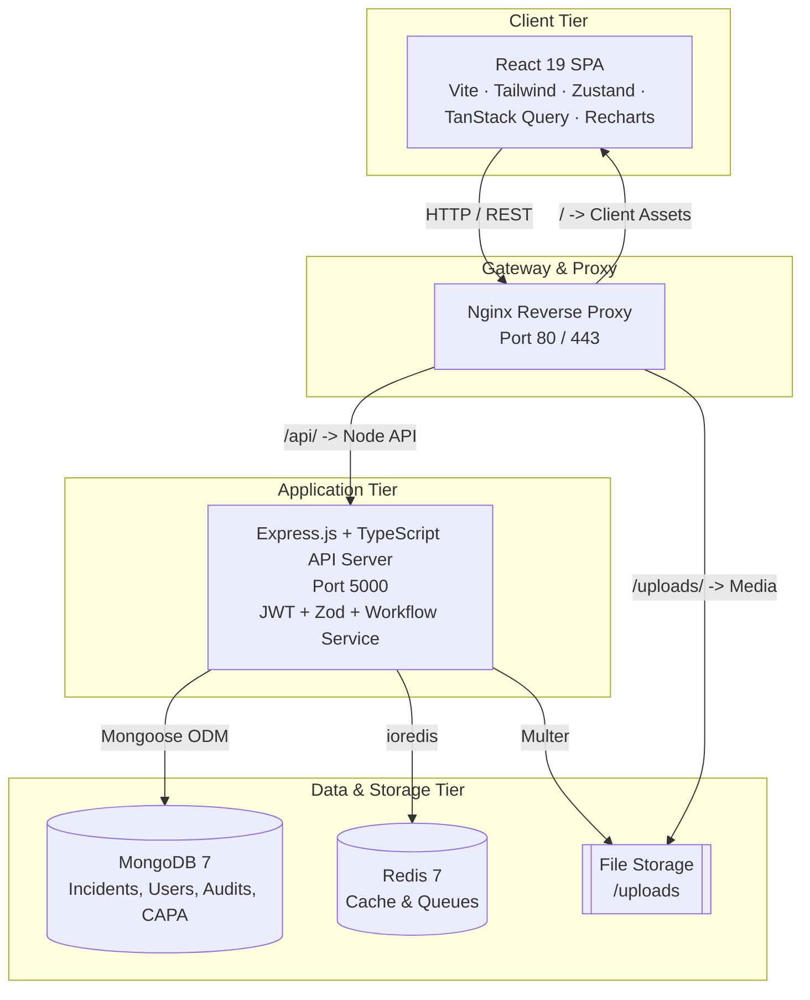
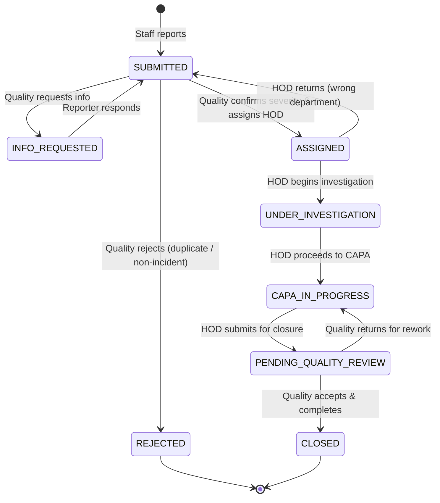

# 🏥 Adhiparasakthi Hospitals – Incident Reporting & Patient Safety Platform


An enterprise-grade, hospital-wide Incident Reporting, Clinical Investigation, Root Cause Analysis (RCA), and Corrective & Preventive Action (CAPA) platform engineered for **Adhiparasakthi Hospitals** (1000-bed multi-specialty healthcare facility).

Designed with a **"Just Culture" / Blame-Free Patient Safety philosophy**, this platform streamlines safety event capture by frontline staff, clinical triage by the Quality team, departmental investigations and CAPA execution by Department Heads (HODs), and executive oversight by Hospital Leadership and System Administrators.

---

## 📑 Table of Contents

- [Key Features](#-key-features)
- [The 4-Role Workflow](#-the-4-role-workflow)
- [Architecture & Tech Stack](#-architecture--tech-stack)
- [System Architecture Flowchart](#-system-architecture-flowchart)
- [Incident Lifecycle & State Machine](#-incident-lifecycle--state-machine)
- [Repository Structure](#-repository-structure)
- [Prerequisites](#-prerequisites)
- [Production Deployment with Docker](#-production-deployment-with-docker)
- [Local Development Setup](#-local-development-setup)
- [Default Seed Accounts & RBAC](#-default-seed-accounts--rbac)
- [Role Guides](#-role-guides)
- [REST API Endpoints Reference](#-rest-api-endpoints-reference)
- [Automated Testing](#-automated-testing)
- [Environment Configuration](#-environment-configuration)
- [NABH & JCI Patient Safety Alignment](#-nabh--jci-patient-safety-alignment)

---

## 🌟 Key Features

### 1. Rapid Frontline Staff Reporting (2–3 Minutes)
- **Direct staff reporting**: Any hospital staff member (nurse, technician, pharmacist, resident, attendant) can report safety events and near-misses.
- **Just Culture visibility (Decision D6)**: Staff can track their reports in **My Reports** (`/incidents/my-reports`) and see the responsible department, current status, and final closure summary, while internal witness statements and RCA fault trees remain protected.
- **Structured capture**: Department where occurred, specific room/bed, incident category & subcategory, timeline, description, immediate actions, initial severity (Levels 1–5), optional patient details (UHID, IP Number, Bed, Ward, Consultant), and evidence uploads.

### 2. Clinical Triage & Department Routing (Quality Team)
- **Triage Inbox (`/incidents/triage-queue`)**: Dedicated inbox for the Quality & Patient Safety team to review newly submitted reports (`SUBMITTED`).
- **Severity confirmation**: Quality confirms or re-evaluates the reporter's severity on the standard NABH 5-tier harm scale.
- **Department assignment**: Incidents are routed to the accountable clinical or operational department and its designated Head of Department (`ASSIGNED`).
- **Information requests (`INFO_REQUESTED`)**: Quality can query the reporter for missing clinical facts before assignment; staff respond directly within the app.
- **Rejection gate (`REJECTED`)**: Structured rejection with mandatory justification for duplicate reports or non-safety matters.

### 3. Investigation & Root Cause Analysis (HOD)
- **Department Queue (`/incidents/department-queue`)**: HODs manage all active incidents routed to their department.
- **Wrong assignment handling**: HODs can return misrouted incidents back to Quality with justification notes (`hodReturns`).
- **Structured clinical investigations**: Timeline chronology, witness interviews, multi-factorial contributing factors, immediate corrections, and recommendations.
- **5-Why & Fishbone RCA**: Mandatory for major and sentinel events (Severity ≥ 4) covering People, Process, Equipment, Environment, Policy, Training, and Communication.

### 4. CAPA Governance & Verification
- **Corrective vs. Preventive separation**: Targeted action items with departmental assignees, priority levels (`LOW`, `MEDIUM`, `HIGH`, `CRITICAL`), and hard deadlines.
- **Execution & evidence**: HOD marks actions complete and attaches objective verification evidence (`PENDING_VERIFICATION`).
- **Quality effectiveness verification**: Quality audits implemented changes and verifies effectiveness before sign-off.
- **Closure review & rework loop**: When an HOD submits an incident for review (`PENDING_QUALITY_REVIEW`), Quality accepts and closes it (`CLOSED`), or returns it for rework (`CAPA_IN_PROGRESS`) with specific guidance.

### 5. Hospital-Wide Safety Intelligence & Registers
- **Dual-perspective analytics**: Quality and Admin see hospital-wide metrics; HODs see department-scoped data.
- **Turnaround time benchmarks**: Median duration tracking against hospital standards: Submit → Assign (24h target), Assign → Submit for Review (14d target), Review → Close (7d target), Total Cycle (30d target).
- **Quality rework tracking**: Real-time monitoring of send-back rates and active rework counts.
- **NABH/JCI compliance registers**: Master Incident Register and CAPA Compliance Register with direct RFC-4180 CSV streaming, Excel (`.xlsx`), and Print/PDF export.

---

## 👥 The 4-Role Workflow

```
[Staff Reports] ──────► (SUBMITTED) ──────► [Quality Triage & Assignment] ──────► (ASSIGNED)
       ▲                                              │                                  │
       │ (Clarification)                              ▼ (Invalid / Duplicate)            ▼
       └────────────── (INFO_REQUESTED)          (REJECTED)                      [HOD Investigates]
                                                                                         │
                                                                                         ▼
                                                                                (CAPA_IN_PROGRESS)
                                                                                         │
                                                                                         ▼
[Staff Sees Closure Summary] ◄─── (CLOSED) ◄─── [Quality Review] ◄─── (PENDING_QUALITY_REVIEW)
                                                      │
                                                      ▼ (Rework Needed)
                                              (CAPA_IN_PROGRESS)
```

1. **Staff (`STAFF`):** Submits report (`SUBMITTED`), tracks status in **My Reports**, answers Quality clarification requests (`INFO_REQUESTED`).
2. **Quality (`QUALITY`):** Reviews triage queue, confirms severity, routes to department HOD (`ASSIGNED`), audits CAPA effectiveness, approves closure (`CLOSED`), or returns for rework (`CAPA_IN_PROGRESS`).
3. **HOD (`HOD`):** Manages department queue, investigates (`UNDER_INVESTIGATION`), conducts RCA, executes CAPA (`CAPA_IN_PROGRESS`), and submits for review (`PENDING_QUALITY_REVIEW`).
4. **Admin (`ADMIN`):** Executive safety intelligence, read-only oversight across all incidents, and master data management (Users, Departments, Locations, Categories).

---

## 🛠 Architecture & Tech Stack

| Layer | Technologies |
|---|---|
| **Frontend** | React 19, TypeScript, Vite 6, Tailwind CSS 3.4, TanStack React Query v5, Zustand 5, React Router 7, Recharts, Lucide Icons, Axios, Day.js |
| **Backend API** | Node.js 22 LTS, Express.js 4, TypeScript, Mongoose 8 ODM, Zod, Pino Logger, Helmet, Express Rate Limit, Cookie Parser |
| **Database & Cache** | MongoDB 7.0 (Replica-set ready), Redis 7 (caching and queues) |
| **Storage & Reverse Proxy** | Local file storage with streaming / Nginx Reverse Proxy (SSL-ready, API proxying) |
| **Testing & Tooling** | Vitest 3, Supertest, automated state machine rules suite (177 passing tests) |

---

## 🔄 System Architecture Flowchart



---

## 🚦 Incident Lifecycle & State Machine

Every incident transitions through an audited, 8-status state machine:



### Severity Matrix (NABH 5-Tier Standard)

| Level | Severity Name | Description | Mandatory Actions |
|---|---|---|---|
| **1** | **Near Miss** | Event caught before reaching patient / zero harm. | Logged, trended, department notification. |
| **2** | **Minor Harm** | Minimal harm; first-aid or extra monitoring required. | HOD investigation, local corrective action. |
| **3** | **Moderate Harm** | Required medical intervention or extended length of stay. | Detailed investigation, mandatory CAPA. |
| **4** | **Major Harm** | Significant permanent or long-term impairment / ICU admission. | Safety committee alert, 5-Why RCA + CAPA within 48h. |
| **5** | **Sentinel Event** | Death, severe injury, wrong-site surgery, transfusion near-event. | Immediate escalation, full Fishbone + 5-Why RCA within 24h. |

---

## 📁 Repository Structure

```
├── client/                     # React 19 Frontend application
│   ├── src/
│   │   ├── App.tsx             # Root router, auth & role guards
│   │   ├── components/         # Layout, KPI cards, charts, modals
│   │   ├── lib/api.ts          # Axios client with JWT auto-refresh
│   │   ├── lib/rbac.ts         # Client-side permission helpers
│   │   ├── pages/              # Role-specific screens (Dashboard, Triage, Department Queue, etc.)
│   │   └── store/useAuthStore  # Zustand authentication state
│   └── vite.config.ts          # Vite build configuration
│
├── server/                     # Express & TypeScript Backend API
│   ├── src/
│   │   ├── app.ts / server.ts  # Express app wiring and server bootstrap
│   │   ├── config/             # DB, Redis, environment, Pino logger
│   │   ├── middleware/         # Auth, RBAC permissions, error handler, rate limiter
│   │   ├── modules/            # Incidents, Investigations, RCA, CAPA, Dashboard, Reports
│   │   └── seeders/            # Reference data, users, and 26 dummy operational incidents
│
├── docs/                       # Architecture and role operational guides
│   ├── ARCHITECTURE.md         # Comprehensive system architecture document
│   ├── FLOW_REWORK_PLAN.md     # 4-role flow specification & design decisions (D1–D11)
│   └── roles/                  # Role-specific guides (STAFF, QUALITY, HOD, ADMIN)
│
├── nginx/nginx.conf            # Reverse proxy routing rules
├── docker-compose.yml          # Full-stack Docker orchestration
└── .env.example                # Canonical environment variables template
```

---

## 💻 Prerequisites

- **Docker & Docker Compose** (Recommended): Docker 24+ and Docker Compose v2+
- *Or for manual local execution:*
  - **Node.js**: v20.x or v22.x LTS
  - **npm**: v10+
  - **MongoDB**: v6.0+ or v7.0+ (running on `localhost:27017`)
  - **Redis**: v7.0+ (running on `localhost:6379`)

---

## 🚀 Production Deployment with Docker

| Service | Address | Notes |
|---|---|---|
| **Web application** | `http://<server>:1006` | nginx: serves the app and forwards `/api` to the backend |
| **Backend API** | `http://<server>:2006` | Express; health check at `/health` |
| **MongoDB** | `127.0.0.1:3006` | Reachable from the server itself only (Compass, scripts). The database has no login, so do not expose it to the network |
| Redis | internal only | Not published; reachable only by the other containers |

```bash
# 1. Create the production settings and fill them in (this file is git-ignored — keep it private)
cp .env.production.example .env.production
#    - APP_URL / API_URL: the address users open (server IP or domain, ports 1006 / 2006)
#    - JWT_ACCESS_SECRET / JWT_REFRESH_SECRET: generate each with `openssl rand -hex 48`

# 2. Build and start
docker compose --env-file .env.production up -d --build

# 3. Check it is healthy
docker compose ps
curl http://localhost:2006/health
```

Open **http://&lt;server&gt;:1006** in a browser.

**First-time data.** An empty database has no roles, departments or users. Load them once with:

```bash
docker compose exec backend node dist/seeders/index.js
```

> ⚠️ The seeder also creates **demo accounts with well-known passwords** (e.g. `admin` / `Admin@123`) and demo incidents.
> On a real system, change every seeded password (Administration → User Directory → Reset Password) or remove the demo users before staff start using it.

**Production safeguards built in**
- The backend refuses to start if the JWT secrets are missing, shorter than 32 characters or still the example values.
- CORS accepts only `APP_URL`. The login cookie is marked `Secure` automatically when `APP_URL` starts with `https://`; over plain `http://` it is not, so login keeps working on an internal network.
- Containers restart automatically, have health checks, rotate their logs, and the API runs as a non-root user.
- Data lives in Docker volumes (`mongo_data`, `redis_data`, `uploads_data`) and survives rebuilds. Back up MongoDB with `docker compose exec -T mongo mongodump --db incident_db --archive --gzip > backup_$(date +%F).gz` (restore with `mongorestore --archive --gzip --drop`).

**Firewall.** Open TCP **1006** (and **2006** only if other systems must call the API directly). Everything else stays closed.

**HTTPS.** For anything beyond a trusted internal network, put TLS in front (a reverse proxy or load balancer terminating HTTPS in front of port 1006), then set `APP_URL` to the `https://` address and rebuild.

---

## 💻 Local Development Setup

```bash
# Backend setup
cd server
npm install
npm run seed      # Seeds roles, departments, locations, categories, users, 26 demo incidents
npm run dev       # Starts Express API on http://localhost:5000

# Frontend setup (in a second terminal)
cd client
npm install
npm run dev       # Starts Vite dev server on http://localhost:5173
```

---

## 👥 Default Seed Accounts & RBAC

The database seeder initializes hospital personas across all four roles. Default password for all seed accounts: `<RoleName>@123`

| Role | Username | Password | Email | Persona Details |
|---|---|---|---|---|
| **Staff** | `nurse.mary` | `Staff@123` | `mary.staff@adhiparasakthi.hospital` | Senior Staff Nurse, Emergency Medicine |
| **Quality** | `quality.anita` | `Quality@123` | `anita.quality@adhiparasakthi.hospital` | Dr. Anita, Chief Quality Officer |
| **HOD** | `hod.emergency` | `Hod@123` | `ramesh.hod@adhiparasakthi.hospital` | Dr. Ramesh, HOD Emergency Medicine |
| **HOD** | `hod.icu` | `Hod@123` | `lakshmi.icu@adhiparasakthi.hospital` | Dr. Lakshmi, HOD Intensive Care Unit |
| **Admin** | `admin` | `Admin@123` | `admin@adhiparasakthi.hospital` | IT System Administrator |
| **Admin** | `md.director` | `Admin@123` | `suresh.md@adhiparasakthi.hospital` | Dr. Suresh, Medical Director (Executive Oversight) |

All departmental HODs are seeded: `hod.emergency`, `hod.icu`, `hod.ot`, `hod.ward`, `hod.pharmacy`, `hod.radiology`, `hod.lab`, `hod.quality`.

---

## 📚 Role Guides

Detailed, one-page operational guides for each role are available in `docs/roles/`:

- [🩺 Staff Role Guide](docs/roles/STAFF.md): Rapid incident reporting, tracking submissions in My Reports, responding to information requests, and understanding blame-free visibility.
- [🛡️ Quality & Patient Safety Role Guide](docs/roles/QUALITY.md): Triage queue management, severity confirmation, department assignment, rejection, review queue, CAPA verification, closure sign-off, and compliance registers.
- [👨‍⚕️ Head of Department (HOD) Role Guide](docs/roles/HOD.md): Department queue management, returning misrouted incidents, clinical investigations, 5-Why & Fishbone RCA, CAPA execution, and submitting for closure.
- [⚙️ Administrator & Medical Director Role Guide](docs/roles/ADMIN.md): Executive risk intelligence, hospital-wide incident oversight, user administration, department HOD assignment, locations, and incident categories.

---

## 📡 REST API Endpoints Reference

All endpoints are versioned under `/api/v1`. Authenticated requests require: `Authorization: Bearer <access_token>`.

### Authentication
- `POST /auth/login` – Authenticate with username & password; returns access token + sets refresh cookie
- `POST /auth/refresh` – Exchange refresh cookie for new access token
- `POST /auth/logout` – Invalidate session and clear cookies
- `GET /auth/me` – Retrieve current user profile and permissions

### Incidents & Workflow
- `POST /incidents` – Submit a new incident report (Staff)
- `GET /incidents` – Searchable register of incidents (Quality, Admin)
- `GET /incidents/my-reports` – Incidents reported by current user (Staff)
- `GET /incidents/triage-queue` – Triage inbox for unassigned reports (Quality)
- `GET /incidents/department-queue` – Active incidents assigned to caller's department (HOD)
- `GET /incidents/review-queue` – Incidents submitted for closure review (Quality)
- `GET /incidents/:id` – Retrieve incident details (scoped per role)
- `POST /incidents/:id/assign` – Confirm severity and assign department HOD (Quality)
- `POST /incidents/:id/reject` – Reject invalid/duplicate report with justification (Quality)
- `POST /incidents/:id/request-info` – Request information from reporter (Quality)
- `POST /incidents/:id/respond-info` – Submit response to information request (Reporter Staff)
- `POST /incidents/:id/return-to-quality` – Return misrouted incident to Quality (Assigned HOD)
- `POST /incidents/:id/start-investigation` – Begin investigation (Assigned HOD)
- `POST /incidents/:id/proceed-to-capa` – Transition to CAPA execution (Assigned HOD)
- `POST /incidents/:id/submit-for-review` – Submit completed incident for review (Assigned HOD)
- `POST /incidents/:id/quality-review` – Accept & close (`CLOSED`) or return for rework (`CAPA_IN_PROGRESS`) (Quality)

### Investigations & Root Cause Analysis
- `POST /incidents/:incidentId/investigation` – Save investigation findings, chronology, and interviews (HOD)
- `GET /incidents/:incidentId/investigation` – Retrieve investigation details
- `POST /incidents/:incidentId/rca` – Save 5-Why and Fishbone RCA (HOD)
- `GET /incidents/:incidentId/rca` – Retrieve RCA details

### Corrective & Preventive Actions (CAPA)
- `POST /incidents/:incidentId/capas` – Create a CAPA action item (HOD)
- `GET /incidents/:incidentId/capas` – List CAPA items for an incident
- `GET /capas` – List all CAPAs (scoped by role/department)
- `POST /capas/:id/complete` – Mark CAPA complete with evidence (HOD)
- `POST /capas/:id/verify` – Verify CAPA effectiveness (Quality)

### Analytics & Reports
- `GET /dashboard/overview` – Safety KPIs, turnaround medians, rework rate (`?period=3m|6m|12m|all`)
- `GET /reports/incidents` – Master Incident Register (supports `?format=csv` streaming)
- `GET /reports/capa` – CAPA Compliance Register (supports `?format=csv` streaming)

### Master Data Administration
- `GET/POST/PATCH /departments` – Department directory & HOD assignment (Admin)
- `GET/POST/PATCH /locations` – Hospital rooms, bays, and suites (Admin)
- `GET/POST /categories` – Healthcare incident categories & subcategories (Admin)
- `GET/POST/PATCH /users` – User management and role assignments (Admin)

---

## 🧪 Automated Testing

The platform includes automated Vitest test suites:

```bash
cd server
npm test
```

- **Workflow State Machine Rules (`incidentWorkflow.rules.test.ts` — 172 tests):** Tests all valid and invalid state transitions, role-based permissions, closure gates, and mandatory payload validations.
- **Dashboard & Reporting Consistency (`dashboard.test.ts` — 5 tests):** Validates that hospital-wide and department-scoped dashboard metrics match direct MongoDB database counts on seed data, checks all audit register fields, and verifies RFC-4180 CSV export streaming.

---

## ⚙️ Environment Configuration

Configuration is managed via `.env` files. Key parameters (see `.env.example`):

| Variable | Default Value | Description |
|---|---|---|
| `PORT` | `5000` | Backend Express port |
| `MONGO_URI` | `mongodb://localhost:27017/incident_db` | MongoDB connection URI |
| `REDIS_URL` | `redis://localhost:6379` | Redis connection URI |
| `JWT_ACCESS_SECRET` | *(string)* | Secret key for access tokens |
| `JWT_REFRESH_SECRET` | *(string)* | Secret key for refresh tokens |
| `ACCESS_TOKEN_TTL` | `15m` | Access token lifespan |
| `REFRESH_TOKEN_TTL` | `12h` | Refresh token lifespan |
| `FILE_STORAGE_PATH` | `uploads` | Directory for attachment storage |
| `MAX_FILE_SIZE_MB` | `10` | Maximum attachment size |
| `APP_URL` | `http://localhost:5173` | Frontend application URL (production: `http://<server>:1006`) |
| `API_URL` | `http://localhost:5000` | Backend API URL (production: `http://<server>:2006`) |

---

## 🛡 NABH & JCI Patient Safety Alignment

1. **National Accreditation Board for Hospitals & Healthcare Providers (NABH 5th Edition)**:
   - **Continuous Quality Improvement (CQI.4 & CQI.5)**: Standardized capture, severity categorization, and reporting of all clinical and non-clinical sentinel events.
   - **Patient Safety Goals (PSGs)**: Proactive near-miss capture to identify latent systemic failures before harm reaches the patient.
2. **Joint Commission International (JCI 7th Edition)**:
   - **QPS.7**: Comprehensive Root Cause Analysis for all sentinel events within predefined institutional timeframes.
   - **QPS.8**: Measurable corrective action tracking with independent effectiveness verification.
3. **Just Culture Framework**:
   - Encourages non-punitive reporting of human errors while maintaining accountability for reckless conduct.
   - Preserves patient confidentiality through granular, permission-based data segmentation.

---

## 📄 License & Ownership

Confidential and Proprietary. Developed for **Adhiparasakthi Hospitals**.  
All rights reserved © 2026.