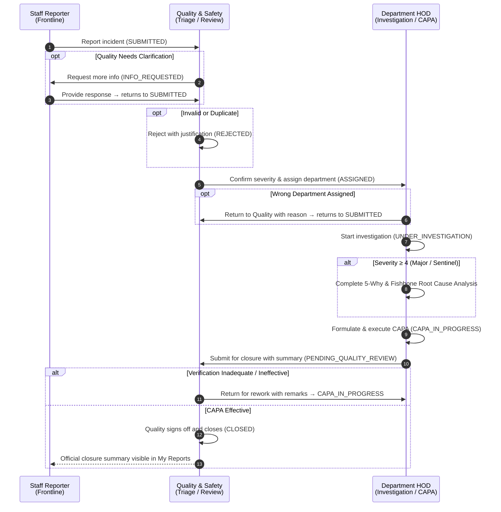
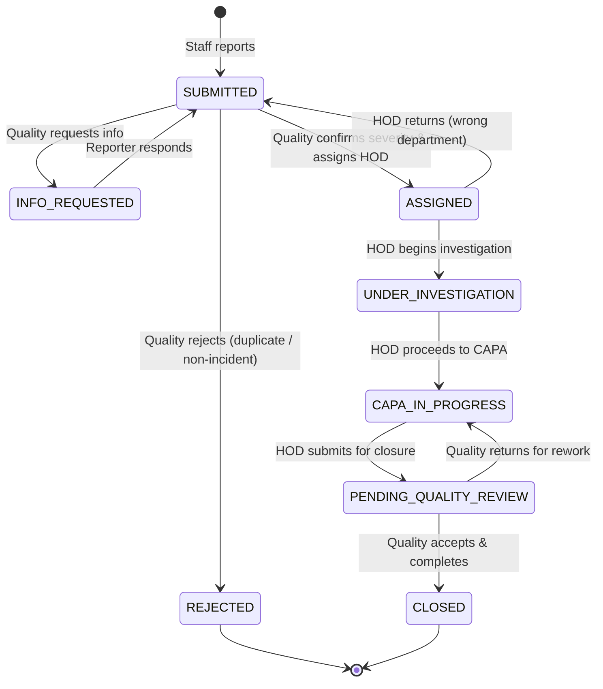
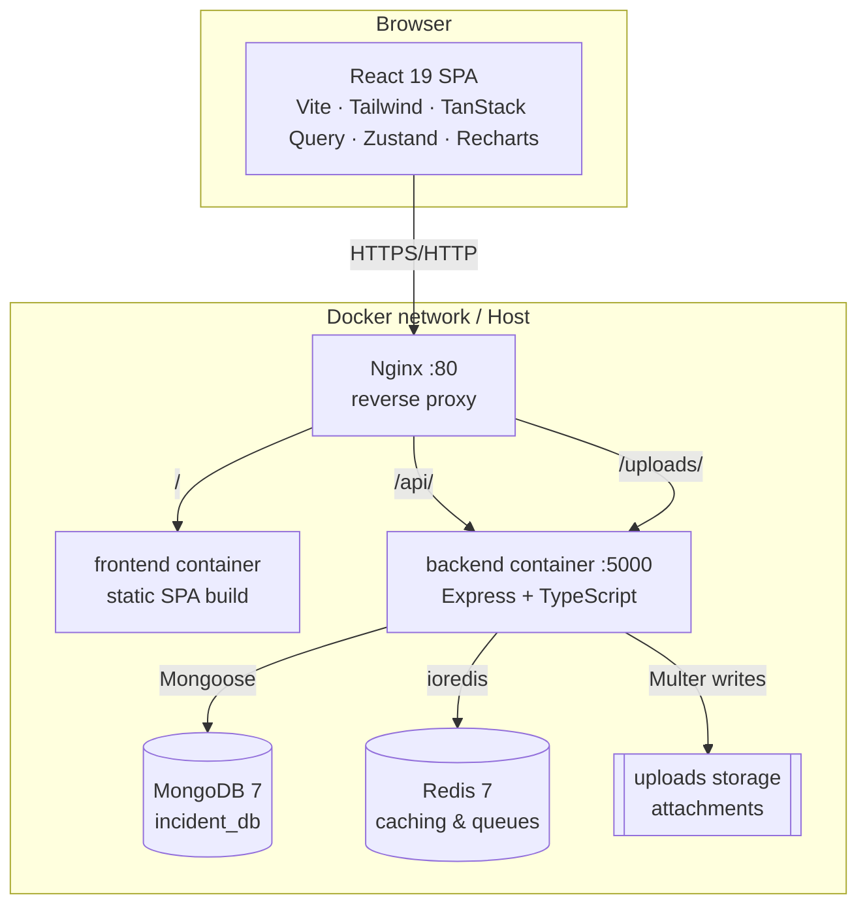
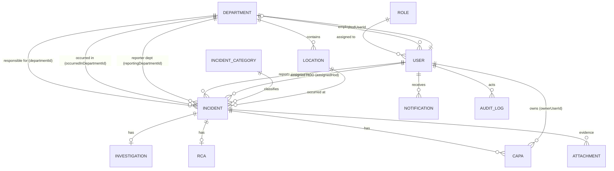

# Incident Reporting Platform — Project Overview & Architecture

Adhiparasakthi Hospitals' incident reporting and patient-safety platform. Hospital staff (nurses, technicians, pharmacists, doctors, attendants) report safety events and near-misses; the Quality & Patient Safety team triages, validates severity, and assigns incidents to the responsible department; the receiving department's Head of Department (HOD) conducts the clinical investigation, performs Root Cause Analysis (RCA), and executes Corrective & Preventive Actions (CAPA); the Quality team verifies CAPA effectiveness, approves closures, and handles any necessary rework; the System Administrator / Medical Directorate oversees hospital-wide safety intelligence and administers master data.

- [1. Who uses it](#1-who-uses-it)
- [2. Incident lifecycle & state machine](#2-incident-lifecycle--state-machine)
- [3. System architecture](#3-system-architecture)
- [4. Technology stack](#4-technology-stack)
- [5. Repository layout](#5-repository-layout)
- [6. Backend](#6-backend)
- [7. Access control (RBAC)](#7-access-control-rbac)
- [8. Data model](#8-data-model)
- [9. API reference](#9-api-reference)
- [10. Frontend](#10-frontend)
- [11. Deployment & configuration](#11-deployment--configuration)
- [12. Seed data & testing](#12-seed-data--testing)
- [13. Patient safety & accreditation alignment](#13-patient-safety--accreditation-alignment)

---

## 1. Who uses it

The platform defines **four distinct system roles**:

| Role | Code | Responsibility | Primary Views & Actions | Seed Persona |
|---|---|---|---|---|
| **Staff Member** | `STAFF` | Rapid frontline reporting (2–3 min) of incidents and near-misses. Tracks own submissions and answers Quality information requests. | Report Incident (`/incidents/new`), My Reports (`/incidents/my-reports`). | `nurse.mary` (`Staff@123`) |
| **Quality & Safety** | `QUALITY` | Hospital-wide clinical safety triage, severity confirmation, departmental assignment, rejection of invalid reports, CAPA verification, closure approval, rework returns, and compliance registers. | Triage Inbox (`/incidents/triage-queue`), Review Queue (`/incidents/review-queue`), CAPA Manager, Executive Dashboard, Quality Reports. | `quality.anita` (`Quality@123`) |
| **Head of Department** | `HOD` | Accountable for incidents assigned to their department. Returns wrongly routed incidents, leads clinical investigations, conducts 5-Why and Fishbone RCAs, writes and carries out CAPAs, and submits for closure. | Department Queue (`/incidents/department-queue`), Incident Detail (Investigation, RCA, CAPA tabs), Department Dashboard, CAPA Manager. | `hod.emergency` (`Hod@123`) |
| **Administrator** | `ADMIN` | Hospital-wide read-only safety oversight (Medical Director view) plus full master data administration (Users, Roles, Departments, Locations, Categories). | Administration Console (`/admin`), Executive Dashboard, Incident Registers, Audit Logs. | `admin` (`Admin@123`), `md.director` (`Admin@123`) |

Every clinical and support department has a designated HOD, linked through `Department.hodUserId`. When Quality assigns an incident to a department, that HOD is set on the incident as `assignedHod`.

---

## 2. Incident lifecycle & state machine



### Severity rules (NABH 5-Tier Scale)

| Severity | Label | RCA required | CAPA required | Escalation |
|---|---|---|---|---|
| 1 | Near Miss | – | – | Logged and trended |
| 2 | Minor Harm | – | – | Departmental awareness |
| 3 | Moderate Harm | – | ✅ | Priority CAPA |
| 4 | Major Harm | ✅ | ✅ | RCA within 48h, safety alert |
| 5 | Critical / Sentinel Event | ✅ | ✅ | Immediate escalation, full Fishbone + 5-Why |

### 8-Status state machine

Enforced by `IncidentWorkflowService` ([incidentWorkflow.service.ts](../server/src/modules/incidents/incidentWorkflow.service.ts)); every transition is written to the immutable `AuditLog` collection.



### Closure gates

`POST /incidents/:id/quality-review` with `decision: 'ACCEPTED'` refuses unless:
1. The investigation is marked `COMPLETED`.
2. If RCA is required (Severity ≥ 4), the RCA is marked `COMPLETED`.
3. If CAPA is required (Severity ≥ 3), at least one CAPA exists and all linked CAPAs are verified `EFFECTIVE`.

---

## 3. System architecture



- The SPA communicates with the backend via relative `/api/v1` routes.
- The API is stateless apart from MongoDB and Redis; authentication uses short-lived JWT access tokens and HTTP-only refresh tokens.
- Uploaded evidence files are stored in `FILE_STORAGE_PATH` and streamed via `/uploads`.

---

## 4. Technology stack

| Layer | Technology |
|---|---|
| **Frontend** | React 19, TypeScript, Vite 6, React Router 7, TanStack React Query 5, Zustand 5, Tailwind CSS 3.4, Recharts, Axios, Day.js, Lucide icons |
| **Backend** | Node.js 22 LTS, Express 4, TypeScript, Mongoose 8, Zod (validation), jsonwebtoken, bcryptjs, Multer, Helmet, express-rate-limit, Pino logger |
| **Data & Cache** | MongoDB 7, Redis 7 |
| **Infrastructure** | Docker Compose, Nginx |
| **Testing** | Vitest 3, Supertest, automated rules & dashboard verification suite |

---

## 5. Repository layout

```
incident-reporting/
├── client/                     React 19 SPA
│   └── src/
│       ├── App.tsx             Routing, auth guards, role guards
│       ├── components/         Reusable UI components (layout, modals, charts)
│       ├── lib/api.ts          Axios instance with auto-refresh on 401
│       ├── lib/rbac.ts         Client-side permission and role helpers
│       ├── store/useAuthStore  Zustand auth session store
│       └── pages/              Dedicated screens for each workflow stage
├── server/                     Express TypeScript API
│   └── src/
│       ├── app.ts / server.ts  Express application bootstrap
│       ├── config/             Environment configuration, DB, logger
│       ├── middleware/         authenticate, requirePermission, rateLimiter, error handling
│       ├── common/             Permissions enum, AppError, response envelope, counter model
│       ├── modules/            Domain modules (incidents, investigations, rca, capa, dashboard, etc.)
│       └── seeders/            System roles, master data, and 26 dummy operational incidents
├── docs/                       Architecture, workflow rework plan, and role guides
│   ├── ARCHITECTURE.md         This document
│   ├── FLOW_REWORK_PLAN.md     Detailed 4-role rework specification & changelog
│   └── roles/                  One-page role operational guides (STAFF, QUALITY, HOD, ADMIN)
├── nginx/nginx.conf            Reverse proxy configuration
└── docker-compose.yml          Full platform orchestration
```

---

## 6. Backend

### Module structure
Each domain under `server/src/modules/` adheres to a strict pattern:
- `*.model.ts`: Mongoose schema, TypeScript document interface, indexes.
- `*.controller.ts`: Zod schema validation, permission checks, business logic, response formatting.
- `*.routes.ts`: Express router with `authenticate` and `requirePermission(...)`.
- `*.service.ts`: Cross-cutting business operations (e.g. `IncidentWorkflowService`, notification dispatcher).

### Authentication & Token Flow
- `POST /auth/login` validates credentials against bcrypt hash and issues:
  - Short-lived **access token** (15 min) in response JSON body.
  - Long-lived **refresh token** (12 h) in HTTP-only `refreshToken` cookie.
- `authenticate` middleware reloads user roles and permissions directly from MongoDB on each request. Permission updates or deactivations take effect immediately without requiring re-login.

### Incident workflow & audit
All status transitions pass through `IncidentWorkflowService.transition()`. Every transition validates:
- Allowed transition from current status per role.
- Mandatory payload fields (e.g., departmentId & assignedHod for assignment, reason for return/rejection, summary for closure submission, remarks for review).
- Automatic audit log creation (`AuditLog`) recording timestamp, actor, previous status, and new status.

---

## 7. Access control (RBAC)

Access control operates on two distinct layers:
1. **Endpoint Permissions:** `requirePermission` / `requireAnyPermission` verifies the user possesses the required permission string.
2. **Record-Level Scope:** Enforced in controllers and query helpers (`incidentAccess.ts`).

### Permission matrix

| Permission | Staff | Quality | HOD | Admin |
|---|:-:|:-:|:-:|:-:|
| `incident.create` | ✅ | | | |
| `incident.read_all` | | ✅ | | ✅ |
| `incident.read_assigned` | | | ✅ (dept) | |
| `incident.triage` | | ✅ | | |
| `incident.assign` | | ✅ | | |
| `incident.close` | | ✅ | | |
| `investigation.manage` | | | ✅ | |
| `rca.manage` | | | ✅ | |
| `capa.create/update/complete` | | | ✅ | |
| `capa.verify` | | ✅ | | |
| `dashboard.view` | | ✅ (hospital) | ✅ (dept) | ✅ (hospital) |
| `report.view_all` | | ✅ | | ✅ |
| `admin.*` (users, roles, departments, master data) | | | | ✅ |

### Record visibility rules (Decision D6: Just Culture)
- **Staff:** Sees own reports in **My Reports** (`/incidents/my-reports`). Sees status, responsible department, and final closure summary. Internal witness statements and RCA fault trees are concealed to preserve psychological safety.
- **HOD:** Sees all incidents where `departmentId` equals their department in **Department Queue** (`/incidents/department-queue`). Has write access to investigation, RCA, and CAPA.
- **Quality & Admin:** Hospital-wide visibility across all departments and statuses.

---

## 8. Data model



### Key Incident document fields:
- `incidentNumber`: Unique year-indexed identifier (e.g., `INC-2026-000001`).
- `reportedBy`: Reference to staff user.
- `reportingDepartmentId`: Department of the reporting staff member.
- `occurredInDepartmentId`: Clinical location where the incident occurred.
- `departmentId`: Accountable department assigned by Quality.
- `assignedHod`: Head of Department accountable for resolution.
- `initialSeverity`: Severity chosen by the frontline reporter.
- `severity`: Severity confirmed by Quality (determines RCA/CAPA mandates).
- `status`: One of the 8 canonical statuses (`SUBMITTED`, `INFO_REQUESTED`, `REJECTED`, `ASSIGNED`, `UNDER_INVESTIGATION`, `CAPA_IN_PROGRESS`, `PENDING_QUALITY_REVIEW`, `CLOSED`).
- `assignments`: History of assignments, including department, HOD, severity, and actor timestamp.
- `infoRequests`: Information requests asked by Quality and answers submitted by the reporter.
- `rejection`: Reason and timestamp if rejected by Quality.
- `hodReturns`: History of returns by HOD back to Quality ("wrong department").
- `closureSubmission`: Summary and timestamp submitted by HOD.
- `qualityReviews`: History of Quality review decisions (`ACCEPTED` or `RETURNED` for rework).
- `closureRemarks`, `closedAt`, `closedBy`: Final closure metadata.

---

## 9. API reference

Base path: `/api/v1`. All routes except `/auth/login` and `/auth/refresh` require authentication.

| Area | Method & Path | Description | Access |
|---|---|---|---|
| **Auth** | `POST /auth/login` | Sign in with username & password; returns access token + sets refresh cookie | Public |
| | `POST /auth/refresh` | Issue new access token using refresh token cookie | Public |
| | `POST /auth/logout` | Clear refresh token cookie | Authenticated |
| | `GET /auth/me` | Fetch active user profile, roles, and permissions | Authenticated |
| **Incidents** | `POST /incidents` | Submit a new incident report | Staff |
| | `GET /incidents` | List all incidents with filters (status, department, severity, search) | Quality, Admin |
| | `GET /incidents/my-reports` | List incidents reported by the logged-in staff member | Staff |
| | `GET /incidents/triage-queue` | List incidents awaiting Quality triage (`SUBMITTED`, `INFO_REQUESTED`) | Quality |
| | `GET /incidents/department-queue` | List active incidents assigned to caller's department | HOD |
| | `GET /incidents/review-queue` | List incidents awaiting Quality closure review (`PENDING_QUALITY_REVIEW`) | Quality |
| | `GET /incidents/:id` | Get incident details (scoped per role) | Scoped |
| | `POST /incidents/:id/assign` | Confirm severity & assign responsible department | Quality |
| | `POST /incidents/:id/reject` | Reject incident with justification reason | Quality |
| | `POST /incidents/:id/request-info` | Request additional information from reporter | Quality |
| | `POST /incidents/:id/respond-info` | Respond to Quality's information request | Reporter Staff |
| | `POST /incidents/:id/return-to-quality` | Return wrongly assigned incident to Quality | Assigned HOD |
| | `POST /incidents/:id/start-investigation` | Transition incident to `UNDER_INVESTIGATION` | Assigned HOD |
| | `POST /incidents/:id/proceed-to-capa` | Transition incident to `CAPA_IN_PROGRESS` | Assigned HOD |
| | `POST /incidents/:id/submit-for-review` | Submit completed incident for Quality closure review | Assigned HOD |
| | `POST /incidents/:id/quality-review` | Accept & close (`CLOSED`) or return for rework (`CAPA_IN_PROGRESS`) | Quality |
| **Investigation** | `POST /incidents/:incidentId/investigation` | Create or update investigation record | Assigned HOD |
| | `GET /incidents/:incidentId/investigation` | Fetch investigation record | HOD, Quality, Admin |
| **RCA** | `POST /incidents/:incidentId/rca` | Create or update 5-Why and Fishbone RCA | Assigned HOD |
| | `GET /incidents/:incidentId/rca` | Fetch RCA record | HOD, Quality, Admin |
| **CAPA** | `POST /incidents/:incidentId/capas` | Create CAPA item | Assigned HOD |
| | `GET /incidents/:incidentId/capas` | Fetch CAPA items for incident | HOD, Quality, Admin |
| | `GET /capas` | List all CAPA items (scoped by role/department) | HOD, Quality, Admin |
| | `POST /capas/:id/complete` | Mark CAPA item complete with evidence | Assigned HOD |
| | `POST /capas/:id/verify` | Verify CAPA item effectiveness | Quality |
| **Dashboard** | `GET /dashboard/overview` | Executive safety KPIs, turnaround medians, triage age, rework rate (`?period=3m\|6m\|12m\|all`) | Quality, Admin, HOD |
| **Reports** | `GET /reports/incidents` | Master Incident Register (`?format=csv` for RFC-4180 streaming) | Quality, Admin, HOD |
| | `GET /reports/capa` | CAPA Compliance Register (`?format=csv` for RFC-4180 streaming) | Quality, Admin, HOD |
| **Master Data** | `GET/POST/PATCH /departments` | Manage departments and HOD assignments | Admin |
| | `GET/POST/PATCH /locations` | Manage hospital rooms, bays, and suites | Admin |
| | `GET/POST /categories` | Manage incident categories & subcategories | Admin |
| | `GET/POST/PATCH /users` | Manage user accounts, designations, and roles | Admin |

---

## 10. Frontend

The client SPA is organized around clear role-specific workflows:

| Route | Page Component | Visible To | Primary Functionality |
|---|---|---|---|
| `/login` | `LoginPage` | Public | Sign in with demo quick-login presets (Staff, Quality, HOD, Admin). |
| `/dashboard` | `DashboardPage` | All roles | Role-specific KPI grids, turnaround time strip, monthly trend, and NABH severity charts. |
| `/incidents/new` | `ReportIncidentPage` | Staff | 2–3 min rapid reporting form with location, category, severity, and evidence upload. |
| `/incidents/my-reports` | `MyReportsPage` | Staff | Personal submission history, status tracker, and info-request response prompts. |
| `/incidents/triage-queue` | `TriageQueuePage` | Quality | Triage inbox: severity confirmation, department assignment, rejection, info requests. |
| `/incidents/department-queue` | `DepartmentQueuePage` | HOD | Department incident queue, return-to-quality, investigation, and CAPA triggers. |
| `/incidents/review-queue` | `ReviewQueuePage` | Quality | Review queue: CAPA verification, closure acceptance, and rework returns. |
| `/incidents` | `IncidentRegisterPage` | Quality, Admin, HOD | Master searchable register with multi-criteria filters. |
| `/incidents/:id` | `IncidentDetailPage` | Scoped | Multi-tab incident workspace (Summary, Investigation, RCA, CAPA, Review). |
| `/capas` | `CapaManagerPage` | Quality, Admin, HOD | CAPA compliance management, overdue flags, and verification. |
| `/reports` | `QualityReportsPage` | Quality, Admin, HOD | Master Incident and CAPA Registers with CSV, Excel, and Print/PDF export. |
| `/admin` | `AdminMasterPage` | Admin | Administration console for Users, Departments, Locations, Categories. |

---

## 11. Deployment & configuration

### Local development
```bash
# Backend
cd server
npm install
npm run seed      # Seeds roles, departments, locations, categories, users, 26 dummy incidents
npm run dev       # Starts Express API on port 5000

# Frontend
cd ../client
npm install
npm run dev       # Starts Vite dev server on port 5173
```

### Docker Compose
```bash
docker compose up -d --build
docker compose exec backend npm run seed
```

---

## 12. Seed data & testing

### Seed personas & default credentials
Password for all demo accounts: `<RoleName>@123`

| Role | Username | Password | Full Name & Designation |
|---|---|---|---|
| **Staff** | `nurse.mary` | `Staff@123` | Nurse Mary (Senior Staff Nurse, Emergency) |
| **Quality** | `quality.anita` | `Quality@123` | Dr. Anita Quality Head (Chief Quality Officer) |
| **HOD** | `hod.emergency` | `Hod@123` | Dr. Ramesh (HOD Emergency Medicine) |
| **HOD** | `hod.icu` | `Hod@123` | Dr. Lakshmi (HOD Intensive Care Unit) |
| **Admin** | `admin` | `Admin@123` | System Administrator (IT Administrator) |
| **Admin** | `md.director` | `Admin@123` | Dr. Suresh Medical Director (Executive Leadership) |

### Automated test coverage
The repository includes automated Vitest test suites verifying:
- Pure workflow state machine rules and permission guards ([incidentWorkflow.rules.test.ts](../server/src/modules/incidents/incidentWorkflow.rules.test.ts) — 172 tests).
- Dashboard and reporting consistency ([dashboard.test.ts](../server/src/modules/dashboard/dashboard.test.ts) — 5 tests) validating hospital-wide and department-scoped database counts, audit fields, and RFC-4180 CSV exports.

Execute tests with:
```bash
cd server && npm test
```

---

## 13. Patient safety & accreditation alignment

The platform directly aligns with:
- **NABH 5th Edition (Patient Safety & Quality Improvement - PSQ standards):** Standardized 5-tier harm taxonomy, mandatory CAPA for moderate/severe harm, and mandatory 5-Why/Fishbone RCA for sentinel events.
- **Joint Commission International (JCI) QPS Standards:** Systematic event capture, root-cause investigation within defined timeframes, and post-intervention effectiveness verification.
- **Blame-Free Just Culture:** Encourages frontline incident and near-miss reporting by keeping internal fault investigations confidential to Quality and HODs, while providing reporters with visible closure summaries and learning points.
