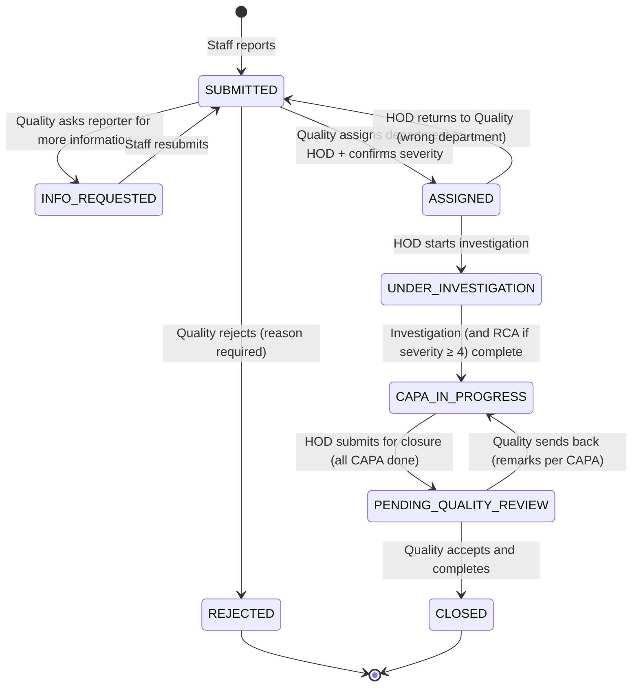

# Workflow Rework — Phase-by-Phase Development Plan

**Goal:** replace the current "any HOD reports, receiving HOD handles" flow with a four-role flow where staff report, Quality routes, HODs resolve, Quality signs off, and Admin oversees and administers.

```
Staff reports ──► Quality triages & assigns ──► HOD investigates, writes CAPA, submits for closure ──► Quality reviews CAPA & completes
                        │                               │                                                   │
                        └─ returns to staff / rejects   └─ returns to Quality (wrong department)            └─ sends back to HOD
Admin: views all dashboards and reports (read-only on incidents); manages users, departments, locations, categories
```

This plan builds on the current codebase (see [ARCHITECTURE.md](ARCHITECTURE.md)). File references point to what exists today.

---

## Contents

- [Decisions to confirm before starting](#decisions-to-confirm-before-starting)
- [Target design](#target-design)
  - [Roles and permissions](#roles-and-permissions)
  - [Incident state machine](#incident-state-machine)
  - [Who sees what](#who-sees-what)
- [Phase 0 — Design sign-off](#phase-0--design-sign-off)
- [Phase 1 — Roles, permissions and users](#phase-1--roles-permissions-and-users)
- [Phase 2 — Data model and workflow engine](#phase-2--data-model-and-workflow-engine)
- [Phase 3 — Backend API](#phase-3--backend-api)
- [Phase 4 — Notifications](#phase-4--notifications)
- [Phase 5 — Frontend](#phase-5--frontend)
- [Phase 6 — Dashboards and reports](#phase-6--dashboards-and-reports)
- [Phase 7 — Seed data and documentation](#phase-7--seed-data-and-documentation)
- [Phase 8 — Testing](#phase-8--testing)
- [Phase 9 — Migration and rollout](#phase-9--migration-and-rollout)
- [Summary timeline](#summary-timeline)
- [Risks](#risks)

---

## Decisions to confirm before starting

These change the scope of later phases. Confirmed decisions are marked ✅; the others are proposed defaults that the rest of this plan assumes until confirmed.

| # | Question | Decision | Status |
|---|---|---|---|
| D1 | Does **Admin** only view data, or also manage users, departments, locations and categories? | Admin views all dashboards and reports **and** manages users, departments, locations and categories. Quality has no admin screens. | ✅ Confirmed |
| D2 | What happens to the current **MD** role? | Replaced by Admin. Existing MD users become Admin. | ✅ Confirmed |
| D3 | Who picks the department? | Staff fill in the incident details on the form, including the **department where it occurred**. Only Quality assigns the incident to the **responsible department's HOD**; this may differ from the department staff entered. | ✅ Confirmed |
| D4 | Does Quality still approve the RCA as a separate step? | No separate step. The HOD writes the RCA (required for severity ≥ 4) and Quality reviews it as part of the final review. | ✅ Confirmed |
| D5 | Can the HOD hand the investigation to someone else? | No. The assigned HOD investigates personally. The "Assign Investigator" feature is removed. | ✅ Confirmed |
| D6 | What does staff see after reporting? | Status, current owner (department), and the final closure summary. Not the investigation, RCA or CAPA details. | ✅ Confirmed |
| D7 | Can Quality reject a report (duplicate, not an incident)? | Yes, with a mandatory reason; the reporter is notified. | ✅ Confirmed |
| D8 | Who sets severity? | Staff gives an initial severity; Quality confirms or changes it at assignment (this is what sets RCA/CAPA requirements). The HOD cannot change it. | ✅ Confirmed |
| D9 | Can a closed incident be reopened? | **No.** Closed is final. If a problem recurs, staff report a new incident. | ✅ Confirmed |
| D10 | Existing data | Yes. Demo data is reset with new seed data (Phase 7); roles, users and any existing records are converted automatically by migrations at server start. | ✅ Confirmed |
| D11 | Anonymous reporting | Not needed. | ✅ Confirmed |

---

## Target design

### Roles and permissions

| Role | Code | Does |
|---|---|---|
| Staff | `STAFF` | Reports incidents. Sees and tracks own reports. Adds information when Quality asks. |
| Quality | `QUALITY` | Triage inbox: confirms severity, assigns the responsible department HOD, returns to reporter or rejects. Final review: checks investigation, RCA and CAPA, then completes the incident or sends it back to the HOD. |
| Head of Department | `HOD` | Works incidents assigned to their department: investigation, RCA, CAPA, marks CAPA done, submits for closure. Can return a wrongly assigned incident to Quality. |
| Admin | `ADMIN` | Read-only access to every incident, dashboard and report. Manages users (all roles), departments and their HODs, locations and incident categories (D1). |

Permission set (replaces the one in `server/src/common/enums/permissions.ts`):

| Permission | Staff | Quality | HOD | Admin |
|---|:-:|:-:|:-:|:-:|
| `incident.create` | ✅ | | | |
| `incident.read_own` | ✅ | | | |
| `incident.resubmit` (answer "more info" request) | ✅ | | | |
| `incident.read_assigned` (own department's assigned incidents) | | | ✅ | |
| `incident.read_all` | | ✅ | | ✅ |
| `incident.triage` (assign HOD, set severity, return, reject) | | ✅ | | |
| `incident.return_to_quality` | | | ✅ | |
| `investigation.read` | | ✅ | ✅ | ✅ |
| `investigation.write` | | | ✅ | |
| `rca.read` | | ✅ | ✅ | ✅ |
| `rca.write` | | | ✅ | |
| `capa.read` | | ✅ | ✅ | ✅ |
| `capa.write` (create, update, mark done) | | | ✅ | |
| `incident.submit_closure` | | | ✅ | |
| `incident.review` (accept/return CAPA, complete) | | ✅ | | |
| `dashboard.view` | own | all | department | all |
| `report.view_department` | | | ✅ | |
| `report.view_all` | | ✅ | | ✅ |
| `admin.*` (users, departments, locations, categories, audit) | | | | ✅ (D1) |

### Incident state machine



Severity 1–2 incidents with no CAPA required go straight from `UNDER_INVESTIGATION` to `PENDING_QUALITY_REVIEW` when the HOD submits for closure.

**Transition rules** — each transition is allowed only for one role and only when its gate passes:

| From → To | Actor | Gate |
|---|---|---|
| — → `SUBMITTED` | Staff | Required fields valid |
| `SUBMITTED` → `INFO_REQUESTED` | Quality | Question text required |
| `INFO_REQUESTED` → `SUBMITTED` | Reporter (Staff) | Response text required |
| `SUBMITTED` → `REJECTED` | Quality | Reason required |
| `SUBMITTED` → `ASSIGNED` | Quality | Department has an active HOD; severity set |
| `ASSIGNED` → `SUBMITTED` | Assigned HOD | Reason required |
| `ASSIGNED` → `UNDER_INVESTIGATION` | Assigned HOD | — |
| `UNDER_INVESTIGATION` → `CAPA_IN_PROGRESS` | Assigned HOD | Investigation findings present; RCA present if severity ≥ 4; CAPA required (severity ≥ 3) |
| `UNDER_INVESTIGATION` / `CAPA_IN_PROGRESS` → `PENDING_QUALITY_REVIEW` | Assigned HOD | Investigation complete; RCA if required; ≥ 1 CAPA if required; every CAPA `DONE`; closure summary text |
| `PENDING_QUALITY_REVIEW` → `CAPA_IN_PROGRESS` | Quality | At least one CAPA marked "not effective" with remarks, or general remarks |
| `PENDING_QUALITY_REVIEW` → `CLOSED` | Quality | Every CAPA marked "effective"; closure remarks |

**CAPA states:** `OPEN` → `DONE` (HOD, with completion remarks and optional evidence) → `EFFECTIVE` (Quality, at review). A CAPA Quality finds not effective goes straight back to `OPEN`, with Quality's remarks stored on it.

### Who sees what

| Role | Incident list | Incident detail |
|---|---|---|
| Staff | Only incidents they reported | Their report, status, owning department, Quality's questions, final closure summary (D6) |
| Quality | All | Everything; action panel depends on status |
| HOD | Incidents currently or previously assigned to their department | Everything except reporter-only Quality conversation; action panel while assigned to them |
| Admin | All | Everything, read-only |

---

## Phase 0 — Design sign-off

**Goal:** agree on the rules before changing code.

- Confirm decisions D1–D11.
- Walk through the state machine and permission tables above with Quality and a sample of HODs.
- Agree on required fields per step (report form, assignment, investigation, RCA, CAPA, closure).
- Agree on notification recipients (Phase 4).

**Done when:** decisions table is filled in and this document is updated to match.

---

## Phase 1 — Roles, permissions and users

**Goal:** four roles exist with the right permissions; each person logs in with the correct role.

Server:
- Rewrite `server/src/common/enums/permissions.ts` to the permission set above; remove unused ones (`incident.assign`, `rca.approve`, `capa.verify`, `incident.change_severity`, …).
- Rewrite `server/src/seeders/systemRoles.ts`: `STAFF`, `QUALITY`, `HOD`, `ADMIN`. The server already syncs these on startup.
- Role migration (`migrateLegacyRoles` in `server/src/seeders/systemRoles.ts`, run at every server start before the role sync): `QUALITY_ADMIN` → `QUALITY`, `MD` → `ADMIN`; users keep their access. The seeder removes any other roles.
- Seed users: at least one staff user per department, one HOD per department, 1–2 Quality users, 1 Admin.
- Users module: allow creating Staff and HOD users with a department (department required for both). Setting a user as HOD updates `Department.hodUserId`; warn if the department already has one.

Client:
- `client/src/pages/LoginPage.tsx`: quick-login presets for Staff, Quality, HOD, Admin.
- `client/src/pages/AdminMasterPage.tsx` becomes Admin-only (D1): users (role selector — currently hard-coded to HOD — plus department, activate/deactivate, reset password), departments with their HOD, locations, and incident categories. Remove every `admin.*` permission from Quality.

**Done when:** each seeded user logs in and `/auth/me` returns the expected permission list.

---

**Status: ✅ Done (2026-09-19).** Notes:
- Existing routes were re-pointed to the new permissions so the app keeps working until Phases 2–3 replace the workflow: Quality triages, approves RCA, verifies CAPA and closes (`incident.review`); the HOD of the incident's department investigates and writes RCA and CAPA (`investigation.write`, `rca.write`, `capa.write`).
- Investigator assignment is removed (D5): endpoint, investigator list endpoint and UI.
- Until Phase 2, the department staff enter on the report still routes the incident to that department's HOD automatically.
- Seed logins: `nurse.mary` / `Staff@123` (one staff user per department), `quality.anita`, `quality.ravi` / `Quality@123`, `hod.<dept>` / `Hod@123`, `admin`, `md.director` / `Admin@123`.
- Admin screen: users (create, edit role/department/status, reset password, search and role filter), department HOD picker, add location. One active HOD per department is enforced; replacing requires an explicit tick.

---

## Phase 2 — Data model and workflow engine

**Goal:** the database and workflow service represent the new flow and refuse anything outside it.

Incident model (`server/src/modules/incidents/incident.model.ts`):

| Field | Change |
|---|---|
| `status` | New enum: `SUBMITTED`, `INFO_REQUESTED`, `REJECTED`, `ASSIGNED`, `UNDER_INVESTIGATION`, `CAPA_IN_PROGRESS`, `PENDING_QUALITY_REVIEW`, `CLOSED` |
| `reportingDepartmentId` | **New.** Reporter's department, set automatically from the staff user |
| `occurredInDepartmentId` | **New.** Department where the incident occurred, entered by staff on the form (D3) |
| `departmentId` | Meaning changes to **responsible department**, set only by Quality at assignment; empty until then |
| `assignedHod`, `assignedBy`, `assignedAt` | Set by Quality at assignment |
| `initialSeverity` | **New.** What staff reported; `severity` becomes Quality's confirmed value |
| `infoRequests[]` | **New.** `{ question, askedBy, askedAt, response, respondedAt }` |
| `rejection` | **New.** `{ reason, by, at }` |
| `hodReturns[]` | **New.** `{ reason, by, at }` when HOD sends back to Quality |
| `closureSubmission` | **New.** `{ summary, by, at }` from HOD |
| `qualityReviews[]` | **New.** `{ decision: ACCEPTED/RETURNED, remarks, by, at }` |
| `closedBy`, `closedAt`, `closureRemarks` | Set by Quality at completion |
| `investigatorId` | Removed (D5) |

Other models:
- CAPA (`capa.model.ts`): status enum `OPEN`, `DONE`, `EFFECTIVE`, `NOT_EFFECTIVE`; keep `completionRemarks`, `evidence`; `verification` becomes the per-CAPA review result.
- RCA (`rca.model.ts`): drop `approvedBy`/`approvedAt` and the `APPROVED` status (D4); keep `DRAFT` / `COMPLETED`.
- Investigation: `investigatorId` always the assigned HOD.

Workflow engine (`server/src/modules/incidents/incidentWorkflow.service.ts`):
- Replace `allowedTransitions` with a table of `{ from, to, actorRole, gate(incident, user) }` matching the transition rules above.
- `transition()` checks role and gate, applies updates, writes the audit log, and triggers notifications (Phase 4).
- Add a shared `incidentTimeline()` helper built from the audit log for the UI timeline.

Access rules (`server/src/common/helpers/incidentAccess.ts`): rewrite `canViewIncident`, `canManageIncident` and `incidentScopeFilter` for the four roles per [Who sees what](#who-sees-what). Add `isAssignedHod(user, incident)`.

**Done when:** unit tests for every allowed and disallowed transition pass (Phase 8 test harness can start here).

---

**Status: ✅ Done (2026-09-19).** Notes:
- Rules live in `server/src/modules/incidents/incidentWorkflow.rules.ts` (pure, no database) and are applied by `IncidentWorkflowService.perform()` in `incidentWorkflow.service.ts`, which also writes the audit log. `IncidentWorkflowService.timeline()` builds the status history; `availableActions()` lists what the current user can attempt (returned by `GET /incidents/:id` as `availableActions`).
- Actions: `REQUEST_INFO`, `RESPOND_INFO`, `REJECT`, `ASSIGN`, `RETURN_TO_QUALITY`, `START_INVESTIGATION`, `COMPLETE_INVESTIGATION`, `SUBMIT_CLOSURE`, `REVIEW_RETURN`, `REVIEW_ACCEPT`. `CLOSED` and `REJECTED` are final (D9).
- The "responsible HOD" is the HOD of the department the incident is currently assigned to, so a department HOD change takes effect immediately.
- Completing the investigation requires the RCA first for severity 4–5, then moves the incident to `CAPA_IN_PROGRESS` when CAPA is required. Severity 1–2 incidents go straight to Quality review via "submit for closure".
- Concurrent edits: incidents use optimistic concurrency; a stale save returns 409 "changed by someone else".
- Data migration `server/src/migrations/workflowV2.ts` converts existing incidents, CAPA and RCA; it runs once at server start (recorded in the `migrations` collection) and at the start of seeding.
- Reopening was built first and then removed after D9 was decided "No"; migration `2026-09-19-no-reopen` moves any reopened incident back to `CAPA_IN_PROGRESS`.
- Tests: `server/src/modules/incidents/incidentWorkflow.rules.test.ts` (172 unit tests: every action from every status by every role, and every gate) and `incidentWorkflow.service.test.ts` (5 integration tests, run with `TEST_MONGO_URI=<throwaway db> npx vitest run`).
- The old triage, close, RCA-approve and CAPA-verify endpoints were removed here; Phase 3 adds their replacements.

---

## Phase 3 — Backend API

**Goal:** one endpoint per action, each protected by role permission, record scope and workflow gate.

| Actor | Endpoint | Purpose |
|---|---|---|
| Staff | `POST /incidents` | Report, including the department where it occurred; the reporter's department is recorded automatically. Staff cannot set the responsible department. |
| Staff | `GET /incidents?mine=true` | Own reports |
| Staff | `POST /incidents/:id/respond` | Answer Quality's information request → `SUBMITTED` |
| Quality | `GET /incidents/triage-queue` | `SUBMITTED` incidents, oldest first |
| Quality | `POST /incidents/:id/assign` | `{ departmentId, severity, remarks }` → `ASSIGNED`; the form pre-selects the department staff entered, and Quality can change it |
| Quality | `POST /incidents/:id/request-info` | `{ question }` → `INFO_REQUESTED` |
| Quality | `POST /incidents/:id/reject` | `{ reason }` → `REJECTED` |
| HOD | `GET /incidents/my-department` | Incidents assigned to their department |
| HOD | `POST /incidents/:id/return-to-quality` | `{ reason }` → `SUBMITTED` |
| HOD | `POST /incidents/:id/investigation` · `PATCH /investigations/:id` · `POST /investigations/:id/complete` | Investigation (existing, re-scoped) |
| HOD | `POST /incidents/:id/rca` | RCA write/update |
| HOD | `POST /incidents/:id/capas` · `PATCH /capas/:id` · `POST /capas/:id/done` | CAPA (while the incident is in `CAPA_IN_PROGRESS`; editable while `OPEN`) |
| HOD | `POST /incidents/:id/submit-closure` | `{ summary }` → `PENDING_QUALITY_REVIEW` |
| Quality | `GET /incidents/review-queue` | `PENDING_QUALITY_REVIEW` incidents |
| Quality | `POST /incidents/:id/review` | `{ capaResults: [{ capaId, effective, remarks }], decision, remarks }` → `CLOSED` or `CAPA_IN_PROGRESS` |
| All | `GET /incidents/:id/timeline` | Status history for the detail page |
| Admin | existing `GET` endpoints | Read-only, all data |

Remove: `POST /incidents/:id/triage`, `POST /incidents/:id/assign-investigator`, `GET /users/investigators`, `POST /rca/:id/approve`, `POST /capas/:id/verify`, `POST /incidents/:id/close`.

Also:
- Staff response filtering: for Staff, `GET /incidents/:id` returns only the fields allowed by D6 (strip investigation/RCA/CAPA references).
- Validation with Zod on every new body; consistent error messages for failed gates (e.g. "2 CAPA actions are not marked done").
- Attachments: scope `GET /attachments/:id` to users who can view the linked incident (closes a known gap).

**Done when:** the new end-to-end script (Phase 8) passes and every endpoint returns 403 for every role not in the table.

---

**Status: ✅ Done (2026-09-19).** Notes:
- Workflow endpoints are in `server/src/modules/incidents/incident.controller.ts` / `incident.routes.ts`. Each one checks the route permission, then that the user may see the incident (so its status is not revealed to others), then runs the workflow rules, and returns the updated incident with `availableActions`.
- Queues: `GET /incidents/triage-queue` (`?status=INFO_REQUESTED` for reports waiting on the reporter), `GET /incidents/review-queue`, `GET /incidents/my-department` (`?status=` optional). `GET /incidents?mine=true` lists the caller's own reports.
- Staff view (D6): `GET /incidents`, `GET /incidents/:id` and the timeline return an allow-listed subset for Staff — status, owning department, their own Q&A with Quality, rejection reason, final closure remarks. No confirmed severity, HOD, review, investigation, RCA or CAPA details; no names in the timeline.
- Attachments: files are uploaded unlinked and linked to their record on save (only your own, unlinked uploads can be attached). `GET /attachments/:id` and the new `GET /attachments/:id/download` check access; the public `/uploads` folder (Express and Nginx) is removed.
- CAPA target dates cannot be in the past. `POST /capas/:id/complete` was renamed `POST /capas/:id/done`.
- Validation errors return 422 with field details; failed workflow conditions 400; wrong role or person 403; wrong status 409.
- `test_full_lifecycle.sh` rewritten: 55 checks over the full flow (info request, HOD return, Quality send-back, rejection, Staff view, file access) plus a permission matrix of 84 role/endpoint combinations that must be refused.
- The web client still uses the old screens until Phase 5; only the CAPA "mark done" call was updated.

---

## Phase 4 — Notifications

**Goal:** each hand-over tells the next person there is work. Today `createNotification()` is never called by the app, so this is new work.

| Event | Notify |
|---|---|
| Staff submits / resubmits | All Quality users |
| Quality requests information | Reporter |
| Quality rejects | Reporter |
| Quality assigns | Assigned HOD |
| HOD returns to Quality | All Quality users |
| HOD submits for closure | All Quality users |
| Quality sends back | Assigned HOD |
| Quality completes | Reporter and HOD |
| CAPA target date passed (daily job) | Assigned HOD and Quality |

- Call `createNotification()` from `IncidentWorkflowService.transition()` using a per-transition recipient map.
- Daily overdue job: set CAPA `OVERDUE` flag and notify. Use a BullMQ repeatable job (Redis is already running) or a simple `setInterval` scheduler if Redis should stay optional.
- Email: optional, behind a setting; nodemailer and SMTP settings already exist.

**Done when:** each event in the table produces an in-app notification for the right users.

---

**Status: ✅ Done (2026-09-19).** Notes:
- Recipients and messages per step are in `server/src/modules/notifications/workflowNotifications.ts`; `IncidentWorkflowService` calls it after every step and after a new report. The person who acted and inactive users are never notified; a notification failure never blocks or undoes the step.
- Overdue CAPA: `server/src/modules/capa/capaOverdue.job.ts` runs at startup and hourly (no Redis needed). Each overdue CAPA is reported once to the department's current HOD and all Quality users; changing its target date makes it eligible again. Safe with several server instances (each CAPA is claimed atomically).
- Email: off by default. Set `EMAIL_NOTIFICATIONS=true` and the `SMTP_*` settings to also email each recipient (one message per person, with a link to the incident using `APP_URL`).
- Bell menu: clicking a notification opens the incident and marks it read; shows how long ago; closes on outside click; fixed an invalid width class that left it unsized.
- Verified: 5 database tests (`notifications.test.ts`); the end-to-end script produced exactly the expected in-app notifications and matching emails (captured with Mailpit); actions still succeed with the mail server down; browser test of the bell menu.

---

## Phase 5 — Frontend

**Goal:** each role lands on a screen that shows only their work.

Navigation per role (`client/src/components/layout/AppLayout.tsx`, `client/src/App.tsx`, `client/src/lib/rbac.ts`):

| Role | Menu |
|---|---|
| Staff | Report Incident · My Reports |
| Quality | Dashboard · Triage Inbox · Review Queue · All Incidents · CAPA · Reports |
| HOD | Dashboard · My Department's Incidents · CAPA · Reports |
| Admin | Dashboard · All Incidents · CAPA · Reports · Administration |

Screens:

| Screen | Role | Work |
|---|---|---|
| Report Incident (`ReportIncidentPage.tsx`) | Staff | "Department where it occurred" (replaces "Receiving Department"), location filtered by that department, category, patient details, initial severity, attachments; confirmation with incident number |
| My Reports (new) | Staff | List of own reports with status chips; "Action needed" when Quality asked for information; respond inline |
| Triage Inbox (new) | Quality | Queue of `SUBMITTED` incidents with age; open → assign panel (responsible department, pre-filled from the staff entry, with its HOD shown; severity; remarks), request info, reject |
| My Department's Incidents (new, or filtered register) | HOD | Assigned incidents grouped by status; overdue highlight |
| Incident workspace (`IncidentDetailPage.tsx`, reworked) | HOD | Step indicator Investigation → RCA (if required) → CAPA → Submit for closure; each step locked until the previous one is done; "Return to Quality" |
| Review Queue (new) | Quality | `PENDING_QUALITY_REVIEW` incidents; review screen shows investigation, RCA, each CAPA with completion evidence; per-CAPA Effective / Not effective with remarks; Complete or Send back |
| Incident detail (all roles) | All | Timeline from `/incidents/:id/timeline`; action panel chosen from status + role; read-only for Admin; limited view for Staff |
| CAPA Manager (`CapaManagerPage.tsx`) | HOD, Quality, Admin | HOD: mark done; Quality/Admin: read-only list with filters |
| Administration (`AdminMasterPage.tsx`) | Admin | Users with role + department, HOD assignment per department, master data |

Shared components to extract: `StatusBadge`, `SeverityBadge`, `Timeline`, `ActionPanel`, `RemarksDialog`.

**Done when:** each role can complete its part of the flow using only the UI, and no role sees a button the server would refuse.

---

**Status: ✅ Done (2026-09-19)**, ahead of Phase 4 (notifications), which is still to do. Notes:
- New pages: `MyReportsPage` (Staff), `TriageInboxPage` and `ReviewQueuePage` (Quality), `MyDepartmentPage` (HOD). `IncidentRegisterPage` is now "All Incidents" for Quality and Admin; `CapaManagerPage` is a read-only CAPA register that links to the incident, where HODs add and complete CAPA.
- `IncidentDetailPage` rebuilt: progress stepper, one action panel per step (`client/src/components/incident/detail/`), read-only sections for everyone else, timeline, and a limited view for Staff. Panels are chosen from the `availableActions` the server returns.
- Shared pieces: `client/src/lib/incidentMeta.ts` (status and severity labels), `components/incident/` (badges, table, timeline, stepper), `components/ui/primitives.tsx`, `lib/useAction.ts`, `lib/files.ts` (upload, access-checked download).
- Navigation per role with live counts on Triage Inbox, Review Queue, My Department and My Reports; each role lands on its own home page.
- Fixed along the way: the report form pre-filled the occurrence time in UTC; the header logo linked Staff to the dashboard; Staff timeline now shows milestones only (server-side).
- **Deployment fix:** Express did not trust the Nginx proxy, so in Docker every user shared one rate-limit budget (15 logins and 300 requests per 15 minutes, hospital-wide). New `TRUST_PROXY` setting (set to 1 in `docker-compose.yml`) makes limits per user.
- **Deployment fix:** the frontend container used nginx's stock config, so refreshing any page other than `/` returned 404. `client/nginx.conf` now falls back to `index.html` (and caches hashed assets); verified by building the image.
- Verified with a browser test (Edge, 29 checks) covering the whole flow for all four roles, including an info request, a send-back and the Staff and Admin views, with no console errors.

---

## Phase 6 — Dashboards and reports

**Goal:** dashboards measure the new flow.

| Metric | Quality | HOD | Admin |
|---|:-:|:-:|:-:|
| Awaiting triage (count, oldest age) | ✅ | | ✅ |
| Awaiting Quality review | ✅ | | ✅ |
| Assigned to my department, by status | | ✅ | |
| Median time: submit → assign, assign → submit for closure, review → closed | ✅ | ✅ | ✅ |
| Sent back by Quality (rework rate) | ✅ | ✅ | ✅ |
| Overdue CAPA | ✅ | ✅ | ✅ |
| Severity, category and department distribution | ✅ | ✅ | ✅ |
| Monthly trend reported vs closed | ✅ | ✅ | ✅ |

- Update `server/src/modules/dashboard/dashboard.controller.ts` (scoped per role) and `client/src/pages/DashboardPage.tsx` (role-specific cards).
- Reports (`report.controller.ts`, `QualityReportsPage.tsx`): add reporting department, department where it occurred, responsible department, assigned HOD, assignment date, closure date, turnaround times; CSV/Excel export.
- Staff: no dashboard; My Reports is their home page.

**Done when:** numbers on each dashboard match a manual count on seed data.

---

**Status: ✅ Done (2026-09-19).** Notes:
- `server/src/modules/dashboard/dashboard.controller.ts`:
  - `GET /dashboard/overview?period=3m|6m|12m|all` returns full workflow KPIs scoped by user role: Quality and Admin receive hospital-wide analytics; HODs receive department-scoped analytics with department metadata `{ _id, name, code }`.
  - Metrics returned include awaiting triage count + oldest age, awaiting Quality review count + oldest age, department load by status, overdue CAPAs, active rework count, and quality rework rate.
  - Turnaround medians for all 4 workflow milestones: submit → assign, assign → submit for review, review → closed, and total report → close cycle.
  - Distribution breakdowns for NABH severity scale (levels 1–5), categories, departments (for hospital-wide), and monthly reported vs closed trends.
- `client/src/pages/DashboardPage.tsx`:
  - Rebuilt with role-specific KPI grids for Quality/Admin vs HOD.
  - Period selector (3M / 6M / 12M / All) with live queries and instant refresh.
  - Turnaround time metric strip benchmarking each handover against hospital targets.
  - Interactive Recharts charts: Monthly Trend (Reported vs Closed dual bars), Severity Breakdown donut chart with NABH severity color legend and percentages, Incidents by Department, and Top Categories.
- `server/src/modules/reports/report.controller.ts`:
  - Incident and CAPA registers return all required audit fields: reporting department, department where occurred, responsible department, assigned HOD, assignment date, closure date, and explicit turnaround times (`daysToAssign`, `daysAssignToSubmit`, `daysReviewToClose`, `daysToClose`).
  - Added `format=csv` support to both `GET /reports/incidents` and `GET /reports/capa` returning UTF-8 BOM CSV files with RFC-4180 escaping and attachment headers.
- `client/src/pages/QualityReportsPage.tsx`:
  - Rebuilt with dual-tab interface: Master Incident Register (NABH/JCI) and CAPA Compliance Register.
  - Filters for date range, department (pre-locked for HOD), severity, status, overdue actions, and real-time keyword search.
  - Summary KPI cards (Total in register, Closed count/rate, Sentinel/Critical events, Median turnaround cycle).
  - Export tools: Download CSV (direct streaming), Download Excel (styled workbook table), and Print/PDF with dedicated print stylesheets.
- Verified: `server/src/modules/dashboard/dashboard.test.ts` automated tests confirm dashboard figures match direct MongoDB counts on seed data for both hospital-wide and department-scoped views, and verify all audit fields and CSV exports.

---

## Phase 7 — Seed data and documentation

- Rewrite `server/src/seeders/dummyData.ts` so demo incidents cover every status of the new flow, reported by staff, assigned by Quality, worked by the right HOD, including examples of info requests, HOD returns, Quality send-backs and rejections.
- Update `README.md`, `docs/ARCHITECTURE.md` (roles, state machine, API, RBAC), and the login presets.
- Short role guides (one page each) for Staff, Quality, HOD and Admin.

---

**Status: ✅ Done (2026-09-19).** Notes:
- `server/src/seeders/dummyData.ts`:
  - Enriched `DummyIncidentDef` interface with `reportingDepartment`, `occurredInDepartment`, `initialSeverity`, `assignments`, `infoRequests`, `rejection`, `hodReturns`, `qualityReviews`, and `closureSubmission`.
  - Updated operational seeding logic to populate all workflow collections:
    - Seq 2 (Insulin dose error): Includes assignment history and HOD return (`hodReturns`) by Pharmacy HOD back to Quality ("transcription occurred on ICU bedside chart"), followed by Quality re-assignment to ICU HOD.
    - Seq 11 (Needle-stick injury): Includes answered `infoRequests` where Quality requested source patient serology / PEP status and the frontline nurse replied directly with negative rapid serology and PEP starter pack issuance.
    - Seq 13 (Surgical consent missing): In `INFO_REQUESTED` with open clarification request to check with Ward 302 whether the form was physically signed; unassigned to HOD.
    - Seq 24: Seeded in `REJECTED` status with structured rejection reason (duplicate notice of facilities maintenance work order #4401).
    - Seq 25 (Transfusion sentinel near-event): Closed with historical Quality rework loop (`qualityReviews: [{ decision: 'RETURNED' }, { decision: 'ACCEPTED' }]`) covering multi-unit batch transport analysis.
    - Seq 26 (Wrong patient CT scan): In `CAPA_IN_PROGRESS` with active Quality rework loop (`qualityReviews: [{ decision: 'RETURNED' }]`) requiring photographic ID verification before resubmission.
  - Updated seed notifications across roles (`nurse.john`, `hod.emergency`, `hod.radiology`, `quality.anita`, `admin`).
- `docs/ARCHITECTURE.md`:
  - Updated Section 1 (Roles): 4 system roles (`STAFF`, `QUALITY`, `HOD`, `ADMIN`).
  - Updated Section 2 (Lifecycle & State Machine): Sequence diagram and 8-status state machine diagram (`SUBMITTED`, `INFO_REQUESTED`, `REJECTED`, `ASSIGNED`, `UNDER_INVESTIGATION`, `CAPA_IN_PROGRESS`, `PENDING_QUALITY_REVIEW`, `CLOSED`).
  - Updated Section 7 (RBAC): 4-role permission matrix and Decision D6 "Just Culture" record visibility rules.
  - Updated Section 8 (Data Model): ER diagram and incident schema fields (`reportingDepartmentId`, `occurredInDepartmentId`, `assignments`, `infoRequests`, `rejection`, `hodReturns`, `closureSubmission`, `qualityReviews`).
  - Updated Section 9 (API Reference): All new workflow routes (`/assign`, `/reject`, `/request-info`, `/respond-info`, `/return-to-quality`, `/start-investigation`, `/proceed-to-capa`, `/submit-for-review`, `/quality-review`, `/my-reports`, `/triage-queue`, `/department-queue`, `/review-queue`, `/dashboard/overview`, `/reports/incidents`, `/reports/capa`).
- `README.md`:
  - Completely refreshed architecture, 4-role workflow overview, state machine diagram, default seed accounts table (`nurse.mary`, `quality.anita`, `hod.emergency`, `admin`), REST API endpoints reference, and role guide links.
- `docs/roles/`:
  - Created 4 dedicated, comprehensive role operational guides:
    - [STAFF.md](file:///c:/SOLAIRAM/incident-reporting/docs/roles/STAFF.md): Frontline incident reporting, tracking submissions in My Reports, responding to information requests, and blame-free visibility.
    - [QUALITY.md](file:///c:/SOLAIRAM/incident-reporting/docs/roles/QUALITY.md): Triage queue management, severity confirmation, department assignment, rejection, review queue, CAPA verification, closure sign-off, and compliance registers.
    - [HOD.md](file:///c:/SOLAIRAM/incident-reporting/docs/roles/HOD.md): Department queue, returning misrouted incidents, clinical investigations, 5-Why & Fishbone RCA, CAPA execution, and submitting for review.
    - [ADMIN.md](file:///c:/SOLAIRAM/incident-reporting/docs/roles/ADMIN.md): Executive risk intelligence, hospital-wide incident oversight, user administration, department HOD assignment, locations, and incident categories.
- Verification:
  - Database seeder executed successfully: `npm run seed` seeded 26 incidents, 14 investigations, 8 RCAs, 10 CAPAs, and 10 notifications with 0 errors.
  - Automated tests: `npm test` passed 177 tests across pure rules and seed database verification.
  - Client production build: `npm run build` completed cleanly in 8.05s with 0 errors.

---

## Phase 8 — Testing

- **Workflow unit tests** (Vitest): every transition in the rules table, allowed and refused, per role.
- **API integration tests** (Vitest + Supertest against a test MongoDB, e.g. `mongodb-memory-server`): the full flow, plus a permission matrix test that calls every endpoint as every role and checks the expected 2xx/403.
- **End-to-end script:** rewrite `test_full_lifecycle.sh` for the new flow, including the send-back loop and an info-request loop.
- **User acceptance:** scripted scenarios per role with Quality and two HODs, on a staging copy.

---

**Status: ✅ Done (2026-09-19).** Notes:
- **Unit & Rules Test Suite ([incidentWorkflow.rules.test.ts](file:///c:/SOLAIRAM/incident-reporting/server/src/modules/incidents/incidentWorkflow.rules.test.ts))**:
  - 172 unit tests passing, covering every allowed and disallowed state transition across all roles, permission checks, payload validations, and closure gates.
- **Integration Test Suites ([incidentWorkflow.service.test.ts](file:///c:/SOLAIRAM/incident-reporting/server/src/modules/incidents/incidentWorkflow.service.test.ts), [notifications.test.ts](file:///c:/SOLAIRAM/incident-reporting/server/src/modules/notifications/notifications.test.ts), [dashboard.test.ts](file:///c:/SOLAIRAM/incident-reporting/server/src/modules/dashboard/dashboard.test.ts))**:
  - Enabled fallback to local test MongoDB so integration suites run automatically with `npm test`.
  - Full end-to-end service test verifies info requests, assignment, HOD investigation, RCA gating, CAPA completion, closure submission, Quality review returns, re-submission, closure, and milestone timelines.
  - Notification test verifies actor decoupling and recipient notifications across every hand-over.
  - Total Vitest tests: **187 passing tests** across 4 test files with 0 skipped.
- **End-to-End Lifecycle & RBAC Script ([test_full_lifecycle.sh](file:///c:/SOLAIRAM/incident-reporting/test_full_lifecycle.sh))**:
  - Executed via Git Bash against the active API server (`http://localhost:5000/api/v1`).
  - 14 verified execution sections covering staff reporting, D6 visibility restrictions, attachment download security, info request loop, HOD misrouting return loop, assignment to responsible HOD, investigation & RCA gating, CAPA lifecycle, Quality send-back rework loop, rejection path, admin read-only status, dashboard & reports validation, and the permission matrix.
  - Permission matrix strictly verified that **85 unauthorized role/endpoint combinations were refused with HTTP 403**.
  - **Result: `=== ALL CHECKS PASSED ===`**.
- **User Acceptance Testing (UAT) Documentation ([docs/UAT_SCENARIOS.md](file:///c:/SOLAIRAM/incident-reporting/docs/UAT_SCENARIOS.md))**:
  - Authored comprehensive test scripts for 6 key clinical and administrative scenarios with step-by-step actions, expected outcomes, and sign-off criteria:
    1. Standard Clinical Incident Lifecycle (Staff → Quality → Emergency HOD → Quality Review & Closure).
    2. Information Clarification Request Loop (Quality ↔ Staff).
    3. Wrong Department Routing & HOD Return Loop (Quality ↔ Pharmacy HOD ↔ ICU HOD).
    4. Quality Review Rework Send-Back Loop (HOD ↔ Quality).
    5. Structured Rejection of Duplicate / Non-Incident Report.
    6. Executive Oversight, Turnaround Benchmarks & Register Exports.

---

## Phase 9 — Migration and rollout

1. Back up the production database.
2. Run the role migration (Phase 1) and, per D10, clear demo operational data and load real master data (departments, locations, HOD per department).
3. Create staff accounts (bulk import from HR list — CSV import screen or script).
4. Deploy backend and frontend together (status names change, so old clients will not work with the new API).
5. Train Quality first (they own triage), then HODs, then staff.
6. Monitor for two weeks: triage queue age, HOD turnaround, send-back rate, error logs.

---

**Status: ✅ Done (2026-09-19).** Notes:
- **Database Backup & Restore Tooling ([scripts/backup_restore.sh](file:///c:/SOLAIRAM/incident-reporting/scripts/backup_restore.sh), [scripts/backup_restore.ps1](file:///c:/SOLAIRAM/incident-reporting/scripts/backup_restore.ps1))**:
  - Automated point-in-time database snapshot utilities with gzip compression and timestamping.
  - Supports automated pre-flight tool verification, extraction of connection strings from `.env`, and safe restore with `--drop`.
- **Operational Data Purge Script ([resetOperationalData.ts](file:///c:/SOLAIRAM/incident-reporting/server/src/scripts/resetOperationalData.ts))**:
  - Implements Decision D10 via `npm run reset:operational`.
  - Clears demo incidents, investigations, RCAs, CAPAs, notifications, audit logs, and annual counters so live incidents start at `INC-2026-0001`.
  - Strictly preserves master data: roles, departments (and HOD links), locations, categories, and user accounts.
  - Supports `--dry-run` and interactive/force confirmation guards.
- **Staff Account Bulk Import (Backend + CLI + UI)**:
  - **REST API ([user.controller.ts](file:///c:/SOLAIRAM/incident-reporting/server/src/modules/users/user.controller.ts))**: `POST /api/v1/users/bulk-import` with Zod validation, role and department code resolution, temporary password hashing, and conflict/update controls.
  - **CLI Utility ([importStaffCsv.ts](file:///c:/SOLAIRAM/incident-reporting/server/src/scripts/importStaffCsv.ts))**: `npm run import:staff -- <path-to-csv> [--dry-run] [--update]`.
  - **HR Template ([sample_hr_staff.csv](file:///c:/SOLAIRAM/incident-reporting/server/src/seeders/sample_hr_staff.csv))**: Standardized CSV template for hospital HR departments.
  - **Web UI Modal ([AdminMasterPage.tsx](file:///c:/SOLAIRAM/incident-reporting/client/src/pages/AdminMasterPage.tsx))**: "Bulk Import (CSV)" button under User Directory with drag-and-drop file upload, template download, live parsing, table preview, and import result statistics.
  - **Unit & Integration Suite ([userBulkImport.test.ts](file:///c:/SOLAIRAM/incident-reporting/server/src/modules/users/userBulkImport.test.ts))**: 4 tests passing, verifying CSV parsing, bulk creation, password hashing, and update/skip logic. Total suite: **191 passing tests**.
- **Hospital Rollout & Hypercare Guide ([docs/ROLLOUT_PLAN.md](file:///c:/SOLAIRAM/incident-reporting/docs/ROLLOUT_PLAN.md))**:
  - Complete 6-step cutover runbook for infrastructure, atomic deployment, and smoke testing.
  - Role-by-role training schedule prioritizing Quality, then HODs, then frontline Staff.
  - 14-day hypercare monitoring framework with specific SLAs (Triage age < 4h, HOD investigation < 7d, Quality review < 48h, Rework rate < 15%) and rollback contingencies.

---

## Summary timeline

Rough estimate for one full-stack developer; phases 4–6 can overlap once Phase 3 is stable.

| Phase | Content | Status |
|---|---|---|
| 0 | Design sign-off | ✅ Done |
| 1 | Roles, permissions, users | ✅ Done |
| 2 | Data model and workflow engine | ✅ Done |
| 3 | Backend API | ✅ Done |
| 4 | Notifications | ✅ Done |
| 5 | Frontend | ✅ Done |
| 6 | Dashboards and reports | ✅ Done |
| 7 | Seed data and documentation | ✅ Done |
| 8 | Testing | ✅ Done |
| 9 | Migration and rollout | ✅ Done (2026-09-19) |
| | **Project Status** | **100% Complete & Production-Ready** |

## Risks

| Risk | Mitigation |
|---|---|
| Quality becomes a bottleneck (every report and every closure passes through them) | Triage queue age on the dashboard; notifications to all Quality users; consider auto-assignment by location later |
| Department without an HOD blocks assignment | Assignment gate refuses it; Admin screen shows departments with no HOD |
| Staff reluctance to report if they can see too little or fear blame | D6 limits exposure; keep "just culture" wording; consider anonymous reporting later (D11) |
| Scope creep in the incident workspace | Lock the step order and required fields in Phase 0 |
| Old tokens / clients after deploy | Server already reloads permissions per request; deploy client and server together |
